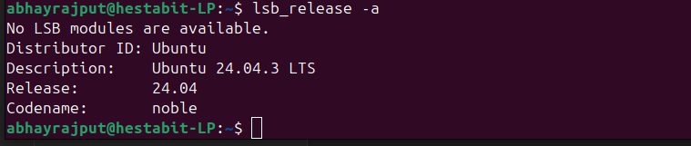
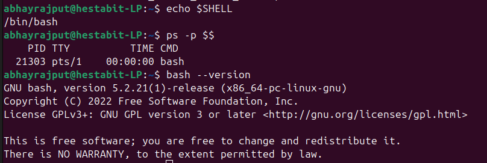

# System Report - Day 1

##OS Information

Raw Commands:

abhayrajput@hestabit-LP:~$ lsb_release -a
No LSB modules are available.
Distributor ID:	Ubuntu
Description:	Ubuntu 24.04.3 LTS
Release:	24.04
Codename:	noble

Image:

##Kernel Information

Raw commands:

abhayrajput@hestabit-LP:~$ uname -a
Linux hestabit-LP 6.14.0-27-generic #27~24.04.1-Ubuntu SMP PREEMPT_DYNAMIC Tue Jul 22 17:38:49 UTC 2 x86_64 x86_64 x86_64 GNU/Linux

Image:

![[Pasted image 20260106195029.png]]

##Shell Information 

Raw Commands:

abhayrajput@hestabit-LP:~$ echo $SHELL
/bin/bash
abhayrajput@hestabit-LP:~$ ps -p $$
    PID TTY          TIME CMD
  21303 pts/1    00:00:00 bash
abhayrajput@hestabit-LP:~$ bash --version
GNU bash, version 5.2.21(1)-release (x86_64-pc-linux-gnu)
Copyright (C) 2022 Free Software Foundation, Inc.
License GPLv3+: GNU GPL version 3 or later <http://gnu.org/licenses/gpl.html>

This is free software; you are free to change and redistribute it.
There is NO WARRANTY, to the extent permitted by law.

Image:

##PATH Inspection

Raw Command:

abhayrajput@hestabit-LP:~$ echo $PATH | tr ':' '\n'
/home/abhayrajput/.nvm/versions/node/v24.12.0/bin
/usr/local/sbin
/usr/local/bin
/usr/sbin
/usr/bin
/sbin
/bin
/usr/games
/usr/local/games
/snap/bin
/snap/bin

Image:

##Node & NVM Status

Raw commands:

abhayrajput@hestabit-LP:~$ which node 
/home/abhayrajput/.nvm/versions/node/v24.12.0/bin/node
abhayrajput@hestabit-LP:~$ node --version 
v24.12.0
abhayrajput@hestabit-LP:~$ npm --version 
11.6.2

Image:

