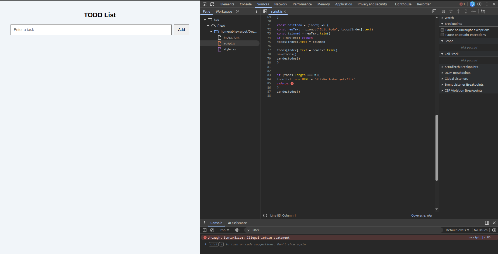
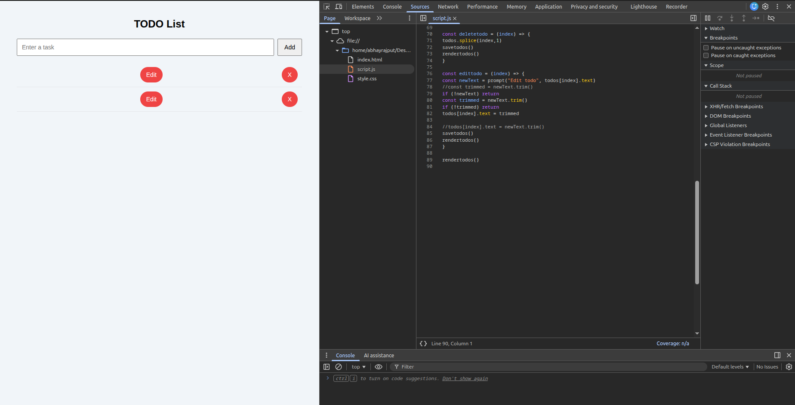

# Day 4 – Errors & Debugging


## 1. Illegal return statement



**Error**
`Uncaught SyntaxError: Illegal return statement`

**Cause**
`return` was used outside of any function block.

**Fix**
Moved the `return` statement inside the `rendertodos()` function.


## 2. Identifier 'rendertodos' has already been declared


**Error**
`Uncaught SyntaxError:Identifier 'rendertodos' has already been declared`

**cause**
`rendertodos` function was declared twice in the same scope.

**Fix**
Removed the duplicate function definition and kept a single source of truth.

## 3. Tasks not visible but buttons were rendering


**Issue**
- `Edit` and `X` buttons appeared
- Task text was missing

**Cause**
Saved todos were strings earlier, but rendering expected objects (`todo.text`).

**Fix**
- Standardized todos to `{ text: value }`
- Cleared localStorage and re-tested


## 4. Empty span element in DOM



**Issue**
`<span></span>` rendered without text content.

**Cause**
Mismatch between stored data and DOM rendering logic.

## 5. Breakpoint pause on form submit


**Observation**
Debugger paused at:
```
js
const value = input.value.trim()
```
