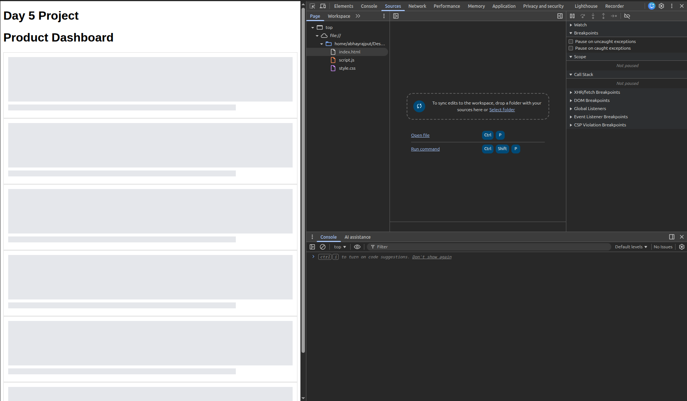
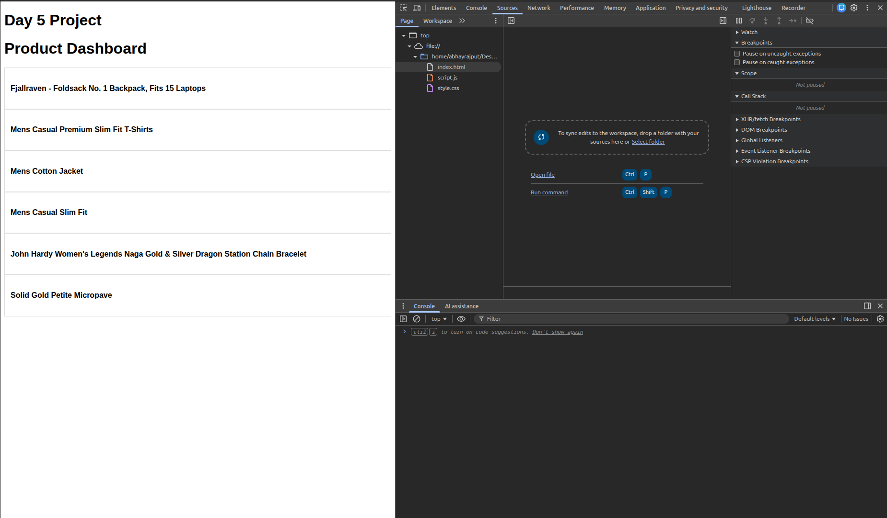
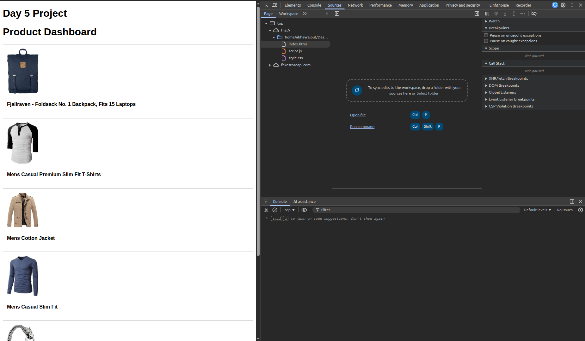
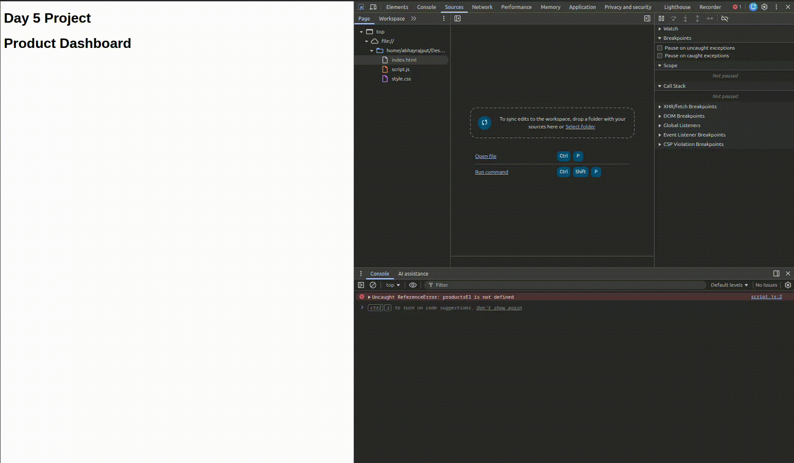
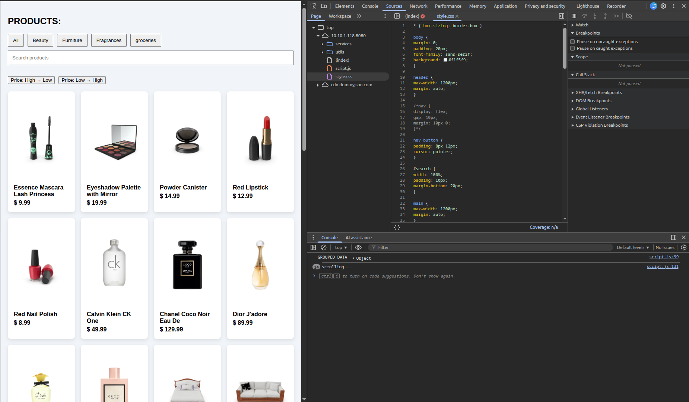
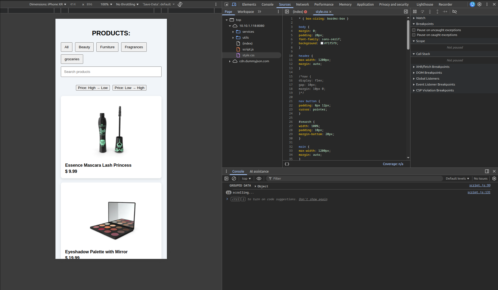

# Day-5 Capstone UI and JS Project:

## Folder Structure

```text
|—Day5
  |—index.html
  |—style.css
  |—script.js
  |—services\
  |—utils\
  |—screenshots\
  |—README.md
```

## Task Done:

- API data fetching
- Progressive rendering
- Skeleton loading
- Filtering, searching, and sorting
- Utility functions (debounce, throttle, groupBy)
- Responsive UI
- Debugging using browser DevTools

### Skeleton Loading:

Initial skaleton loading, in column, while fetching data


### Text loading:

first fetched text will be seen to the users


### Image fetched:

after texts are loaded image will be fetched and displayed.


### Demo layout loading:



### Desktop-view of Ecommerce Website:



### Mobile-Responsive view:



### To Start Project:

open the root folder in terminal and use command:
`npx serve`
