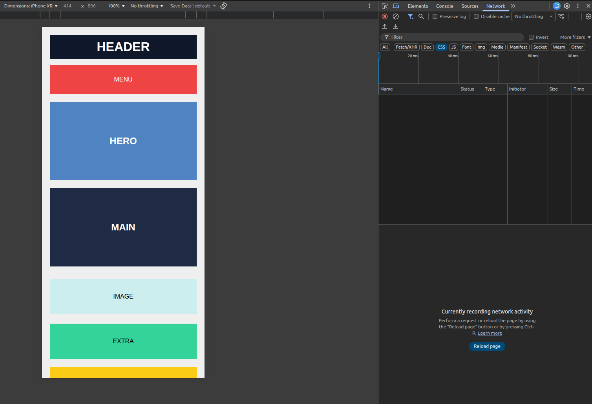

# DAY-2 CSS Layout Mastery:

## Folder Structure:

```text
|—Day2
  |—index.html
  |—style.css
  |—README.md
  |—screenshots
```

## Tasks Done:

- Used semantic HTML elements (`header`, `nav`, `main`, `section`)
- Created a top layout wrapper as separate elements
- Implemented a mobile-first responsive design approach
- Used Flexbox to control layout flow and spacing
- Ensured layout adapts based on viewport width
- Removed rigid dimensions for mobile responsiveness
- Avoided layout hacks and unnecessary wrappers

## Layout Comparison

### Desktop View


### Mobile View 


