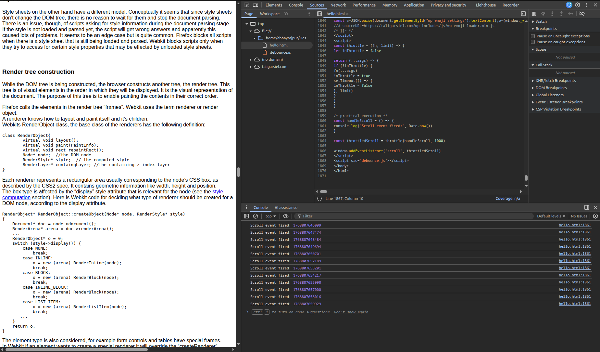

# Day-4 JS Utilities and LocalStorage

## Folder Structure:

```text
|—Day4
  |—index.html
  |—style.css
  |—script.js
  |—screenshots\
  |—logs\
  |—README.md
```
## Tasks Done:

- Debugging real runtime and syntax errors
- Using browser DevTools (breakpoints, scope, watch)
- Understanding rendering issues
- Practicing performance patterns (debounce & throttle)
- Implementing data transformation logic (groupBy)
- Maintaining proper logs

### Todo App:


### Debounce:


### Throttle:



### Groupby:


