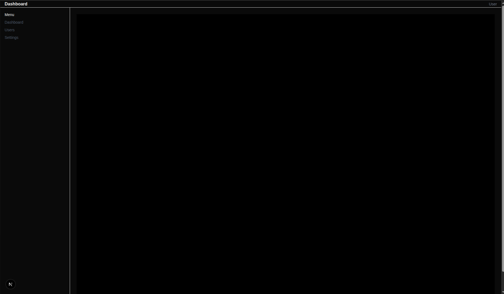
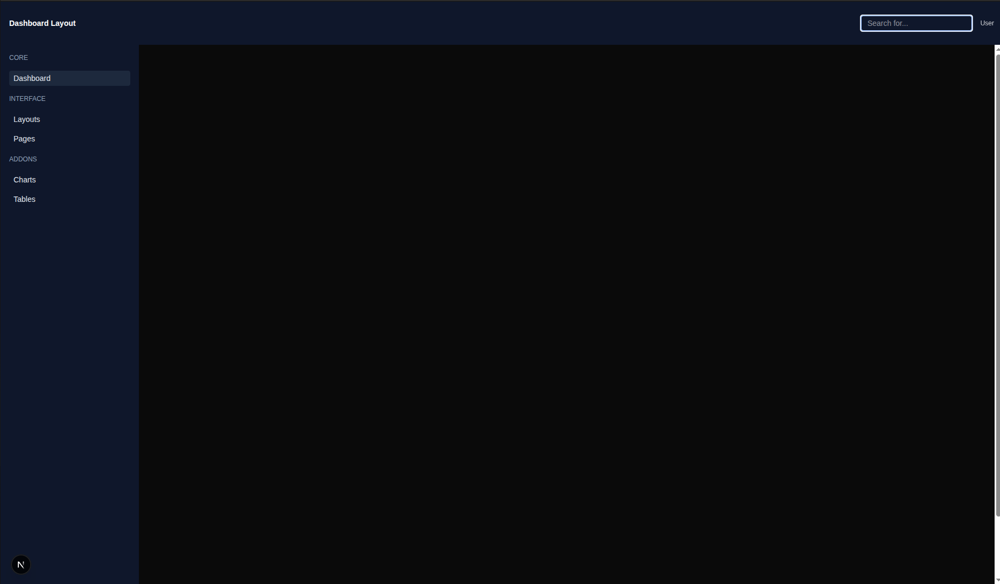

# Day 1 – Dashboard Layout With Next.js And  TailwindCSS

## Folder Structure:

```text
Day-1/
├── app/
│   ├── layout.js
│
├── components/
│   └── ui/
│       ├── Navbar.js    # Top navigation bar
│       └── Sidebar.js   # Left sidebar navigation
│
└── README.md
```

## Project Setup:

First create a next.js project:
```bash
npx create-next-app@latest Week-3-next-tailwind-frontend;
cd week3-next-tailwind-frontend
```
Note: we are using JS, so select no for TypeScript and Src/ directory while creating project.

after that do copy the current files:
- app/layout.js 
- create a directory in root folder naming components with `mkdir components`
- components/ui/Navbar.js
- components/ui/Sidebar.js

## Tasks Done:

- created global layout with layout.js
- implemented a Navigation Bar (Nav)
- implemented a Side Navigation Bar (Sidebar)
- used TailwindCSS classes for layout and spacing
- dashboard UI skeleton


### Initial Skeleton:



### Final Dashboard Layout:



### Start project:

open the terminal with the path of root folder and use command:
```bash
npm run dev
```

after that open the given url in the output to see the live project
