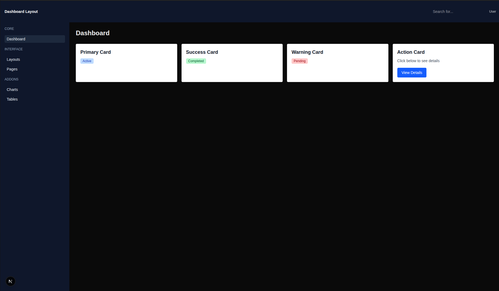

# Day-2 Tailwind Advanced And Component Library

## Folder Structure:

```text
├─ Day-2/
├── app/
│ ├── page.js 
├── components/
│ └── ui/
│ │ ├── Button.js
│ │ ├── Badge.js
│ │ ├── Card.js
│ │ ├── Input.js
│ │ ├── Modal.js
│ │ ├── StatCard.js
│ │ ├── PanelCard.js
├──README.md
├──UI-COMPONENTS-DOCS.md
```
### Project Setup:

First create a next.js project:
```bash
npx create-next-app@latest Week-3-next-tailwind-frontend;
cd week3-next-tailwind-frontend
```
Note: we are using JS, so select no for TypeScript and Src/ directory while creating project.

also copy previous changes from day-1 first.

and after that do copy the current files:
- app/page.js 
- create a directory in root folder naming components with `mkdir components`
- components/ui/Button.js
- components/ui/Badge.js
- components/ui/Card.js
- components/ui/Input.js
- components/ui/Modal.js
- components/ui/StatCard.js
- components/ui/PanelCard.js

## Tasks Done:

- Built reusable UI components: Button, Badge, Card, Input, Modal, StatCard, PanelCard
- Created reusable panels for charts and tables
- Replicated dashboard UI from reference image
- Maintained clean separation of layout and UI logic

## UI Skeleton:

### Initial Layout:



### Final Layout:


## Start project:

open the terminal with the path of root folder and use command:
```bash
npm run dev
```

after that open the given url in the output to see the live project
