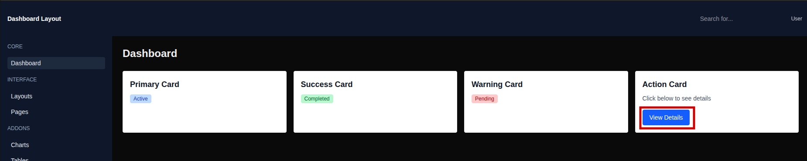
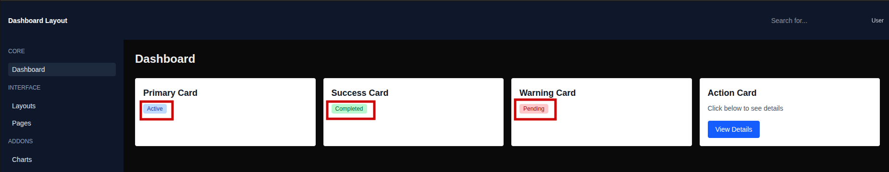
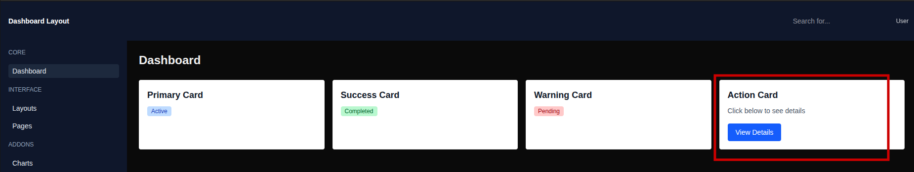
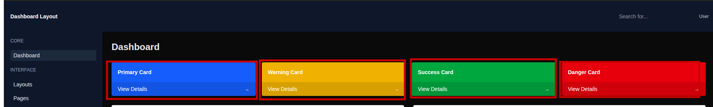
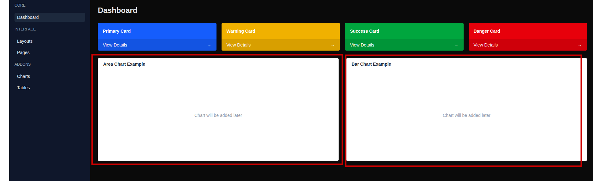

# UI Components Documentation

## Folder Structure

```text
components/ui/
├── Button.js
├── Badge.js
├── Card.js
├── Input.js
├── Modal.js
├── StatCard.js
└── PanelCard.js
```

### Every Component:
- Is reusable
- Made using TailwindCSS and accepts props

### 1. Button Component

- Used for  actions like submission, viewing details, or conforming actions 

`components/ui/Button.js`

```js
import Button from "@/components/ui/Button";

<Button variant="primary">Save</Button>
<Button variant="secondary">Cancel</Button>
<Button variant="danger" size="sm">Delete</Button>
```



### 2. Badge Component

- Used for status labels active, pending, or completed 

`components/ui/Badge.js`

```js
import Badge from "@/components/ui/Badge";

<Badge color="green">Completed</Badge>
<Badge color="red">Pending</Badge>
```



### 3. Card Component

- Used for wrapping content with a title and optional footer.

`components/ui/Card.js`

```js
import Card from "@/components/ui/Card";
import Button from "@/components/ui/Button";

<Card
  title="Action Card"
  footer={<Button>View Details</Button>}
>
  This is card content
</Card>

```



### 4. Input Component

- Used for input form consistent styling .

`components/ui/Input.js`

```js
import Input from "@/components/ui/Input";

<Input label="Email" placeholder="Enter email" />
```

### 5. Modal Component

- Used for dialogs, confirmations, or popup forms.

`components/ui/Modal.js`

```js
"use client";
import { useState } from "react";
import Modal from "@/components/ui/Modal";

const [open, setOpen] = useState(false);

<Modal open={open} title="Confirm" onClose={() => setOpen(false)}>
  Are you sure?
</Modal>

```

### 6. StatCard Component

- Used to display dashboard summary cards (Primary, Warning, Success, Danger).

`components/ui/StatCard.js`

```js
import StatCard from "@/components/ui/StatCard";

<StatCard title="Primary Card" color="blue" />
<StatCard title="Warning Card" color="yellow" />

```



### 7. PanelCard Component

- Used for larger content areas like charts and tables.

`components/ui/PanelCard.js`

```js
import PanelCard from "@/components/ui/PanelCard";

<PanelCard title="Area Chart Example">
  Chart will be added later
</PanelCard>

```


