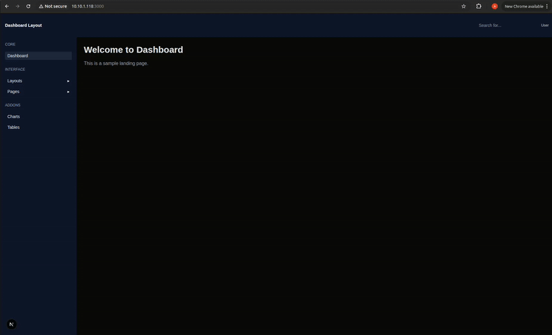

# Day-3 Next.js Routing And Layout System

## Folder Structure:

```text
├─ Day-3/
├── app/
│ ├── page.js
│ ├── about/
│ │ └── page.js 
│ ├── dashboard/
│ │ ├── layout.js
│ │ ├── page.js 
│ └── profile/
│ │ └── page.js 
├── components/
│ └── ui/
│ │ └── Sidebar.js 
├── screenshots/
├──README.md
```
### Project Setup:

First create a next.js project:
```bash
npx create-next-app@latest Week-3-next-tailwind-frontend;
cd week3-next-tailwind-frontend
```
Note: we are using JS, so select no for TypeScript and Src/ directory while creating project.

also copy previous changes from day-1 and day-2 first.

and after that do copy the current files:
- app/page.js 
- app/about/page.js
- app/dashboard/layout.js
- app/dashboard/page.js
- app/profile/page.js
- components/ui/Sidebar.js
## Tasks Done:

- Routing with App Router
- Dashboard Restructuring
- Nested Layouts
- Sidebar Navigation

## Dashboard Layout:



## Start project:

open the terminal with the path of root folder and use command:
```bash
npm run dev
```

after that open the given url in the output to see the live project
