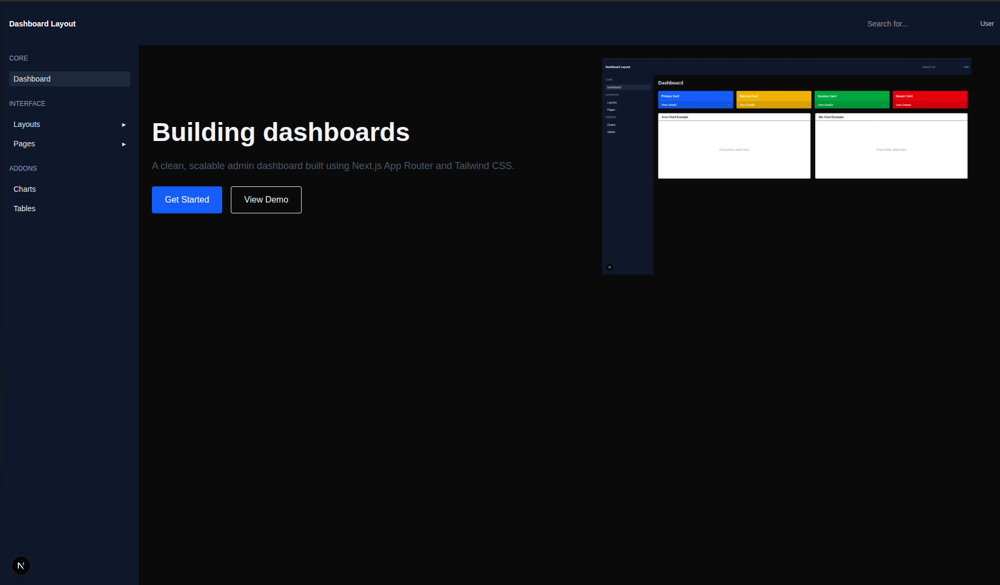
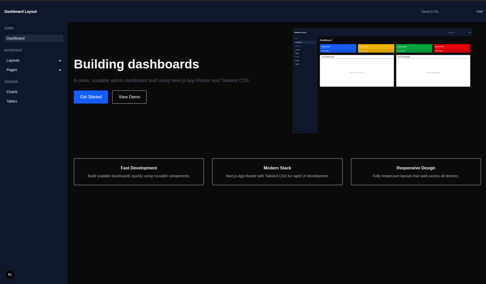
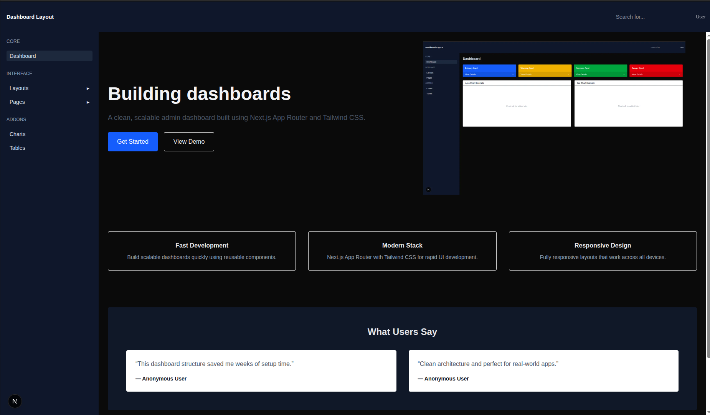
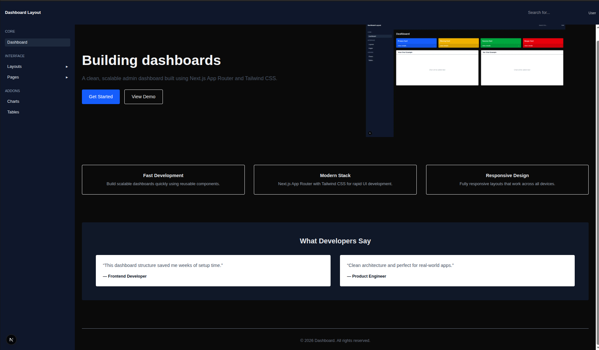
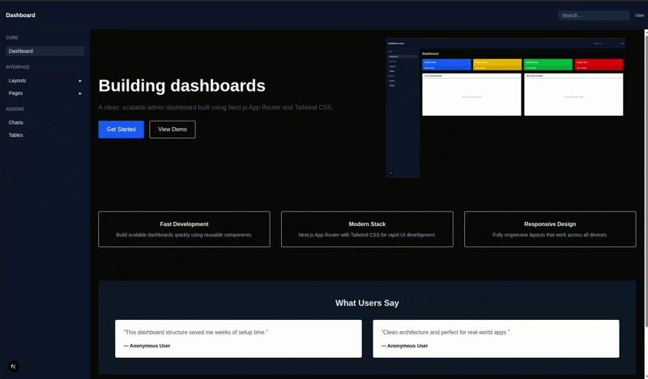

# Day-4 Dynamic UI And Image Optimization

## Folder Structure:

```text
├─ Day-4/
├──app/
│ ├── layout.js 
│ ├── page.js
├── public/
│ └── dashboard-preview.png 
├── components/
│ └── ui/
│ │ └── Sidebar.js
│ │ └── Navbar.js
├── screenshots/
├──README.md
```
### Project Setup:

First create a next.js project:
```bash
npx create-next-app@latest Week-3-next-tailwind-frontend;
cd week3-next-tailwind-frontend
```
Note: we are using JS, so select no for TypeScript and Src/ directory while creating project.

also copy previous changes from day-1, day-2 and day-3 first.

and after that do copy the current files:
- app/page.js 
- app/layout.js
- components/ui/Navbar.js
- components/ui/Sidebar.js

## Tasks Done:

- Responsive Layout System
- Mobile Sidebar Navigation
- Landing Page Improvements
- Image Optimization

## Hero-section:



## Feature-section:



## Testimonials-section:



## Footer-section:



## Layout in Different Layouts:



## Start project:

open the terminal with the path of root folder and use command:
```bash
npm run dev
```
after that open the given url in the output to see the live project
