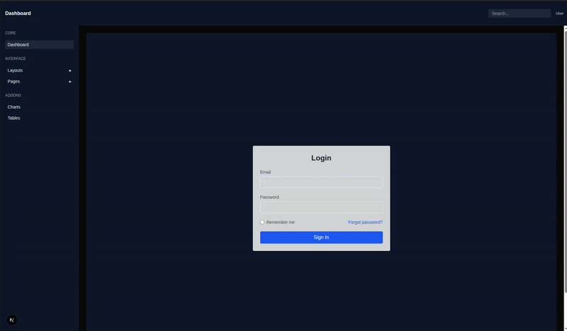
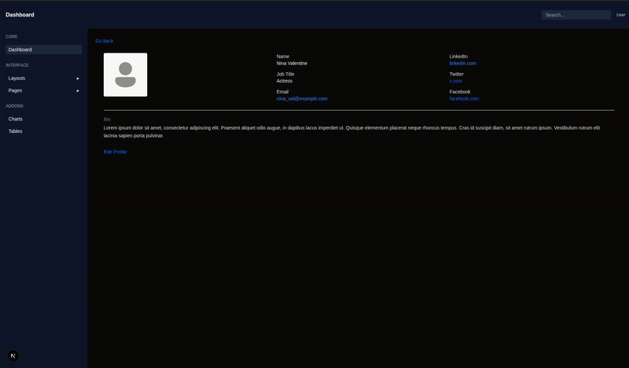
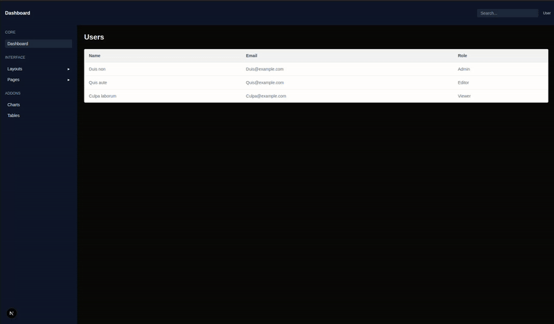
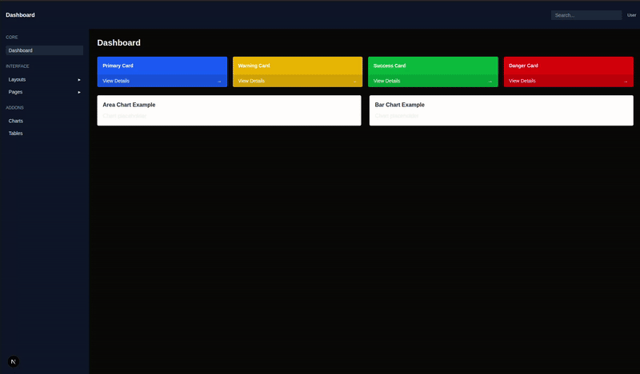

# Day-5 Capstone Mini Project

## Folder Structure:

```text
├─ Day-5/
├──app/
│ ├──dashboard/ 
│ │ ├── users
│ │ │ └──  page.js
│ │ ├── profile
│ │ │ └──  page.js
│ ├── login
│ │ └──  page.js
├── public/
│ └── profile.png 
├── screenshots/
├──README.md
```
### Project Setup:

First create a next.js project:
```bash
npx create-next-app@latest Week-3-next-tailwind-frontend;
cd week3-next-tailwind-frontend
```
Note: we are using JS, so select no for TypeScript and Src/ directory while creating project.

also copy previous changes from day-1, day-2, day-3 and day-4 first.

and after that do copy the current files:
- app/dashboard/users/page.js
- app/dashboard/profile/page.js
- app/login/page.js

## Tasks Done:

- Created a dedicated profile page layout
- Login Page with email and password
- created a Users list
- Used dashboard components
- and made every component device responsive

## Login Page:



## Profile-page:



## Users List section:



## Dashboard Components:



## Start project:

open the terminal with the path of root folder and use command:
```bash
npm run dev
```
after that open the given url in the output to see the live project
