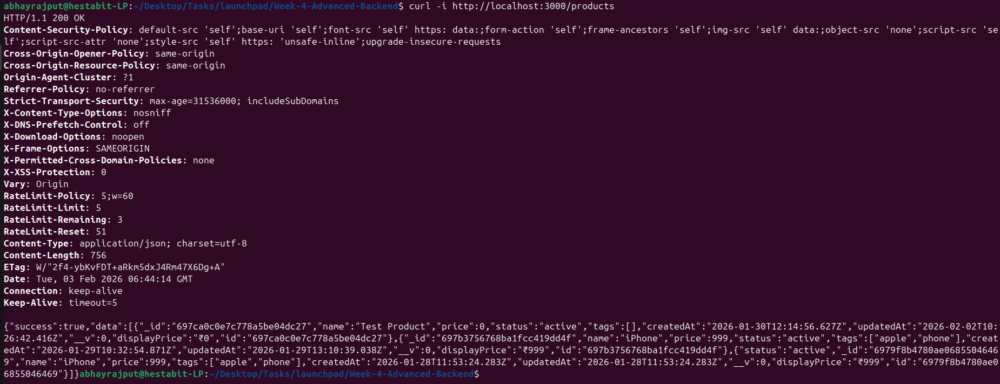

# Day 4 - Security, validation, rate-limiting, and hardening 

## Folder Structure

```text 
day4
└── src
│    ├── config
│    ├── controllers
│    │   └── product.controller.js
│    ├── jobs
│    ├── loaders
│    │   ├── app.js
│    │   └── db.js
│    ├── middlewares
│    │   └── error-middleware.js
│    │   ├── validate.js
│    │   └── securtiy.js
│    ├── models
│    │   ├── Product.js
│    │   └── User.js
│    ├── repositories
│    │   ├── product.repository.js
│    │   └── user.repository.js
│    ├── routes
│    ├── services
│    │   └── product.service.js
│    └── utils
│        └── logger.js
└── screenshots/
└── SECURITY_REPORT.md
└── README.md

```

## Tasks done

- Added request validation using Joi
- Implemented middlewares
  - HTTP security headers (Helmet)
  - CORS handling
  - Rate limiting
- Verified payload size and field validation using curl
- Tested rate limit and CORS behavior via headers

## API Testing with CURL:

### HTTP Security Headers
Security headers are enabled using Helmet to harden the application.

Tested: 
```bash
curl -i http://localhost:3000/products
```


### Rate Limiting
Rate limiting is enabled to prevent rapid requests result in blocking after threshold.

Tested: 
``` bash
for i in {1..120}; do
  curl -s -o /dev/null -w "%{http_code}\n" http://localhost:3000/products
done
```

