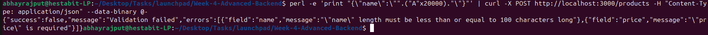

# SECURITY REPORT 

## Rate Limiting
Rate limiting is enabled to prevent rapid requests result in blocking after threshold.

Tested: 
``` bash
for i in {1..120}; do
  curl -s -o /dev/null -w "%{http_code}\n" http://localhost:3000/products
done
```


## CORS
CORS policy is enforced to control cross-origin access, Where requests from unknown origins are handled via headers.

Tested: 
```bash
curl -i -H "Origin: http://evil.com" http://localhost:3000/products
```


## Payload Size Limit
Request body size is restricted to prevent large payload attacks where oversized requests are rejected.

Tested: 
```bash
perl -e 'print "{\"name\":\"".("A"x20000)."\"}"' \
| curl -X POST http://localhost:3000/products \
-H "Content-Type: application/json" \
--data-binary @-
```


## HTTP Security Headers
Security headers are enabled using Helmet to harden the application.

Tested: 
```bash
curl -i http://localhost:3000/products
```

