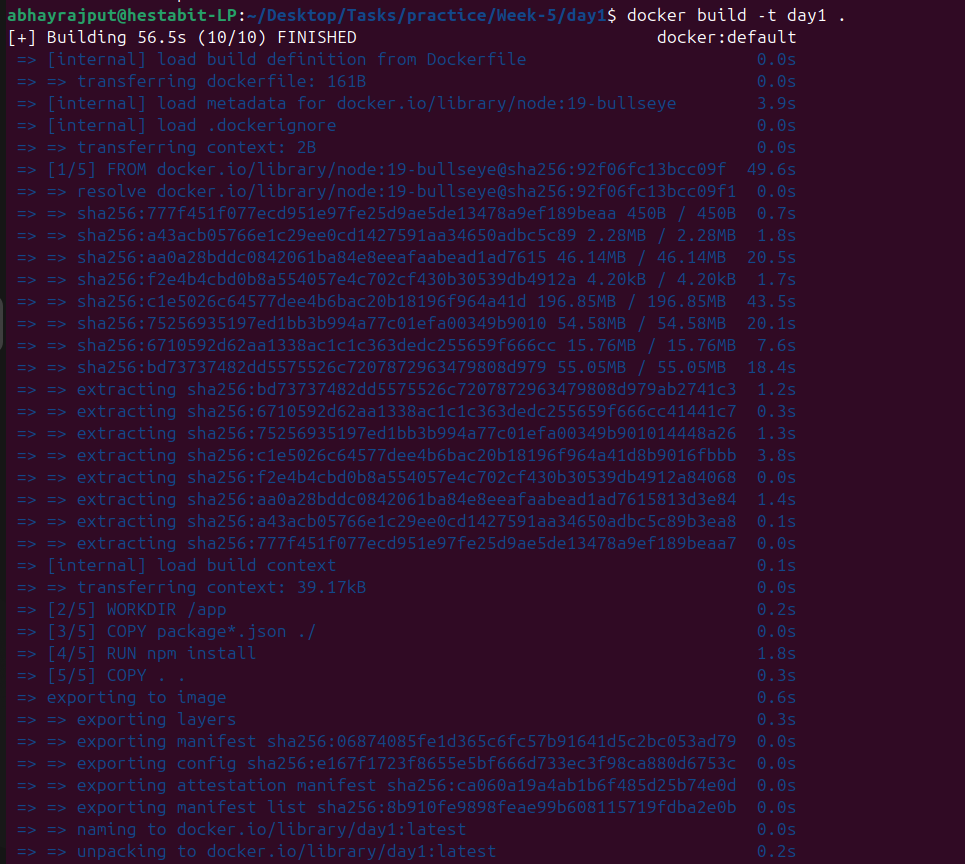
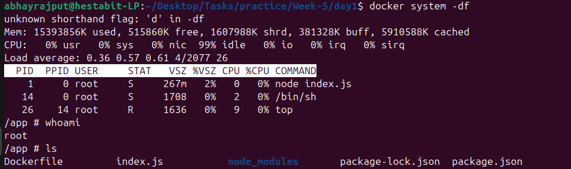
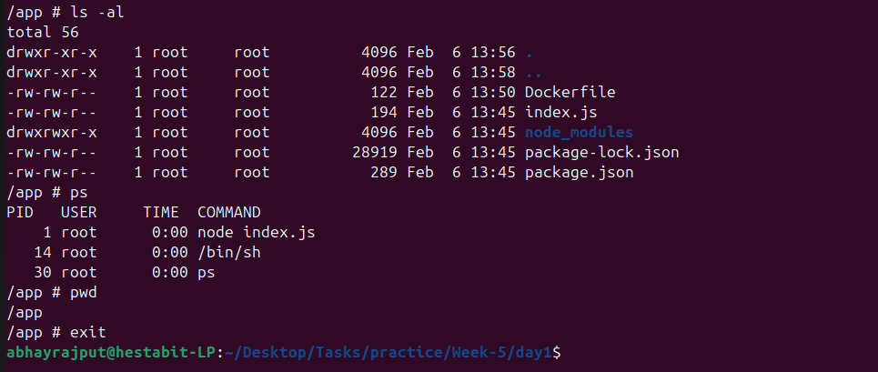

# Linux Inside a Docker Container

## How Port is working inside docker

```text
Browser
  |
  v
Host Machine (localhost:3000)
  |
  |  -p 3000:3000
  v
Docker Engine
  |
  v
Container (port 3000)
  |
  v
Node.js Application
```

## How to Run
```bash
docker build -t day1 .
docker run -d -p 3000:3000 --name day1 day1
```
- For Seeing all running containers
```bash
docker ps
```

- For Viewing Logs in realtime 
```bash
docker logs -f day1
```

- For entering in running container
```bash
docker exec -it day1 sh
```

- For Stopping Container
```bash
docker stop day1
```

## Commands explored

- For checking running process
```bash
ps aux
```

- For Viewing File System
```bash
ls
pwd
ls -la

```

- For exiting container
```bash
exit
```






