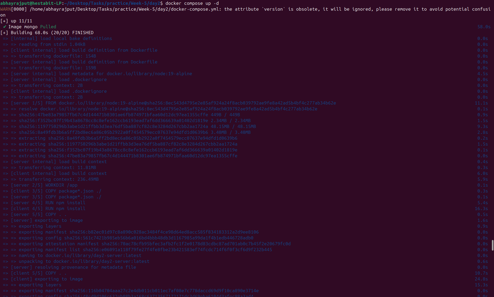
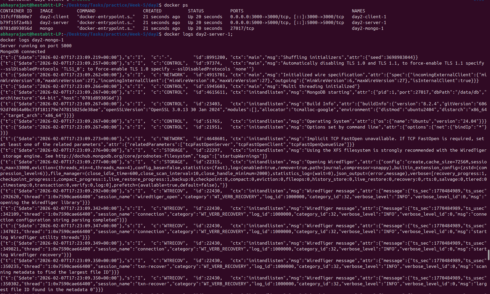

# Day 2 - Docker Compose & Multi-Container Application

## Folder Structure

```text
day2/
│ ├── docker-compose.yml
│ ├── system-architecture.md
│ ├── README.md
│ ├── .gitignore
│ ├── server/
│ │ ├── Dockerfile
│ │ ├── index.js
│ │ └── package.json
│ └── client/
│ │ ├── Dockerfile
│ │ ├── package.json
│ │ ├── public/
│ │ └── src/
```

## Tasks Done

- Created a multi-container application using Docker Compose
- Built a server and client service
- Added MongoDB as a database container
- Managed all services using a single `docker compose up -d` command

## Commands 

- For starting all containers
```bash
docker compose up -d
```

- For stopping containers
```bash
docker compose stop
```

- For restarting stopped containers 
```bash
docker compose start
```

- For Stopping and removing containers
```bash
docker compose down
```

- For Stopping and removing containers with persistent data
```bash
docker compose down -v
```

- For seeing running containers
```bash
docker compose ps
```

- For seeing logs of all services
```bash
docker compose logs
```

- For continuously streaming logs
```bash
docker compose logs -f
``` 




