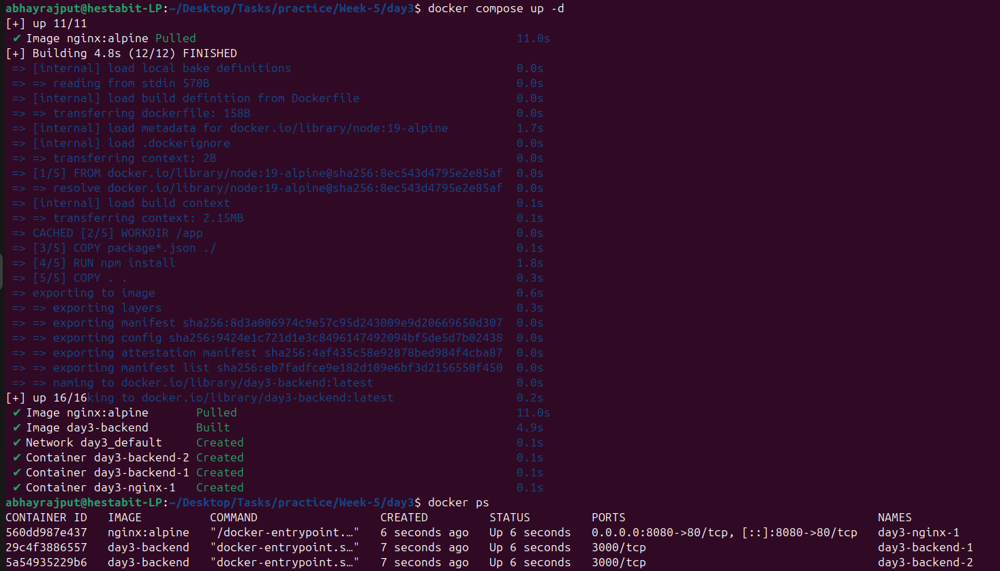
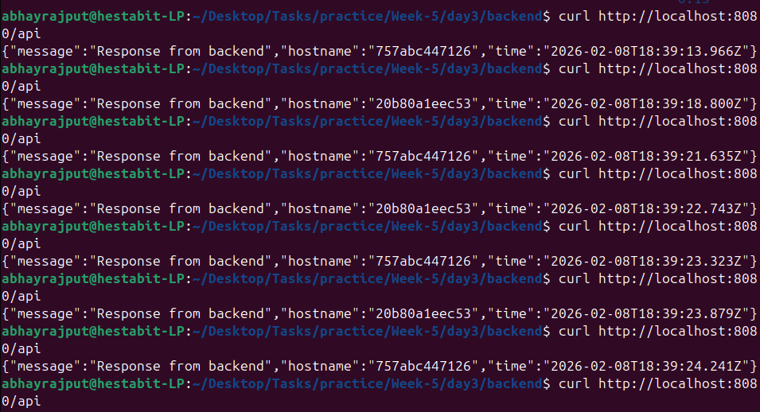
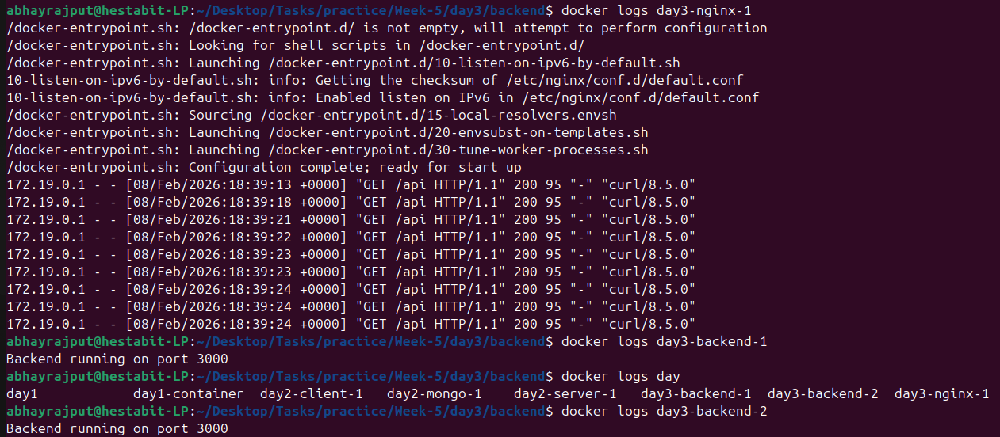

# Day 3 - NGINX Reverse Proxy And Load Balancing

## Folder Structure

```text
day3/
│ ├── docker-compose.yml
│ ├── reverse-proxy-readme.md
│ ├── README.md
│ ├── nginx/
│ │ └── nginx.conf
│ └── backend/
│ ├── Dockerfile
│ ├── index.js
│ └── package.json
```

## Tasks Done

- Configured NGINX as a reverse proxy
- Scaled backend service to multiple instances
- Implemented round-robin load balancing
- Verified load balancing using container hostnames

## Commands Used

- For building container
```bash
docker compose up -d
```



- For seeing round-robin scheduling
```bash
curl http://localhost:8080/api

```



- For building container
```bash
docker logs day3-nginx-1
```


