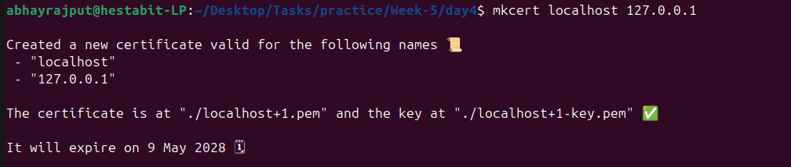
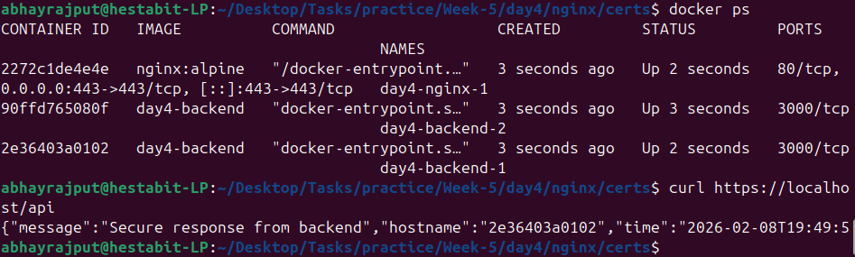
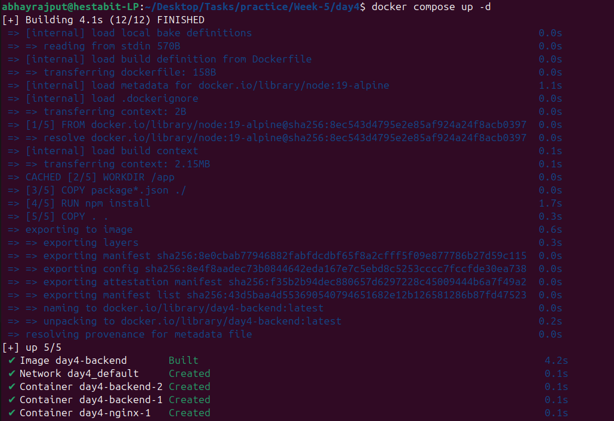
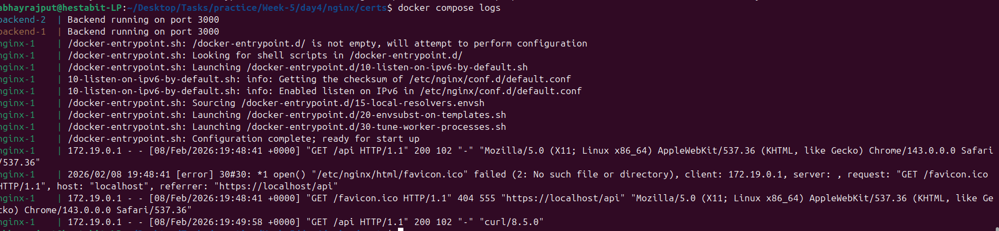

# SSL/TLS Setup

We're using mkcert, which is a developer tool that creates **locally trusted SSL certificates**.
---

## Steps For SSL/TLS Setup

### Install mkcert

```bash
mkcert -install
```

### Generate Certificates

```bash
mkcert localhost 127.0.0.1
```



## Working

```text
You (Browser / curl)
        |
        |  https://localhost/api
        |  (Trusted HTTPS via mkcert)
        v
NGINX (inside Docker)
   - SSL/TLS terminates here
   - Uses mkcert certificates
   - Listens on port 443
        |
        |  HTTP (Docker internal network)
        v
Backend Containers
   - Node.js API
   - No SSL logic
   - Receives plain HTTP
```

- HTTPS exists only between client and NGINX
- Backend services stay simple and secure behind the proxy

## Verification and testing

- Over CLI

```bash
curl https://localhost/api
```



- Inside Browser


## Docker Commands

- For Building Docker Containers
```bash
docker compose up -d 
```



- For seeing logs 
```bash 
docker compose logs
```

