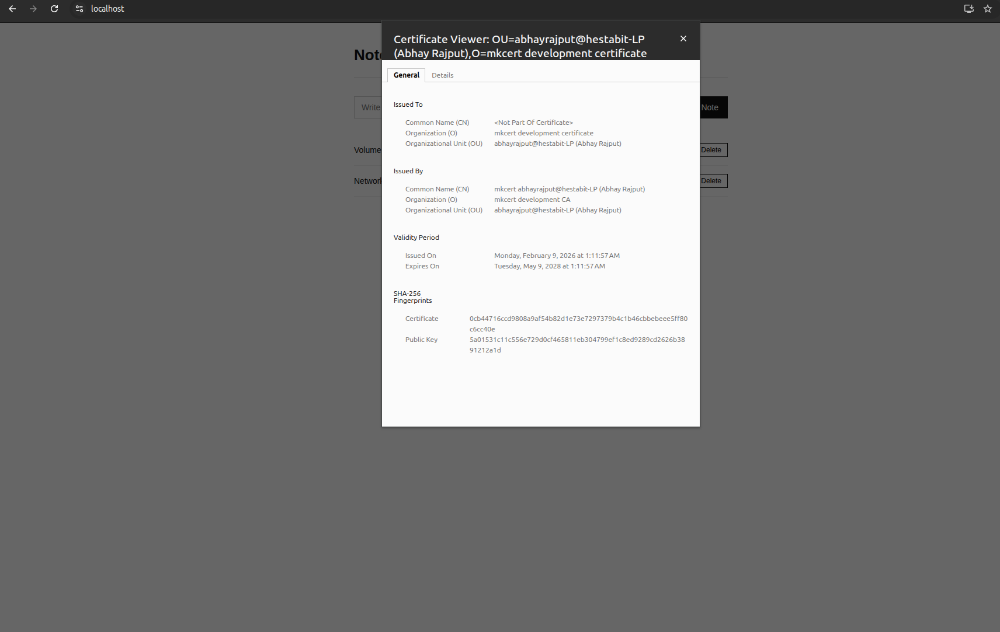
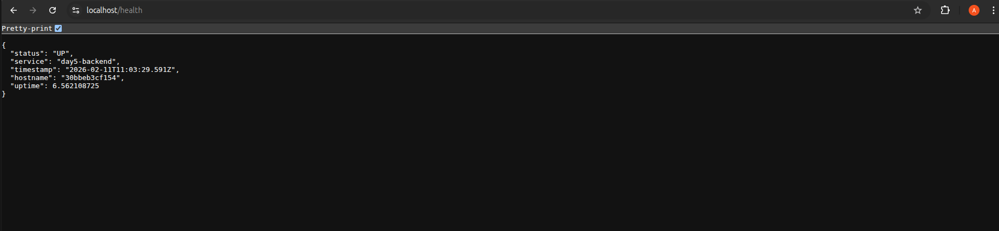
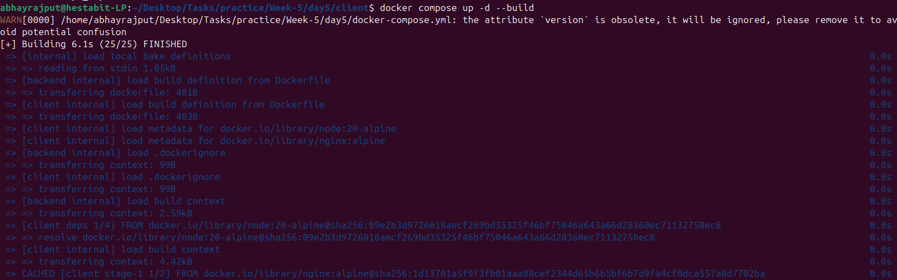
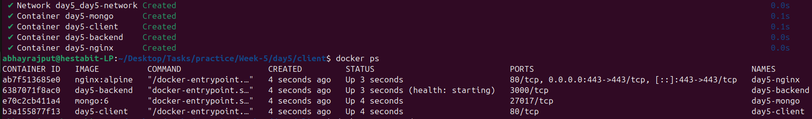
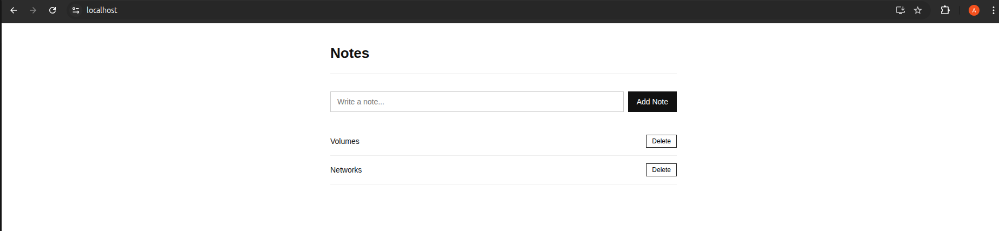
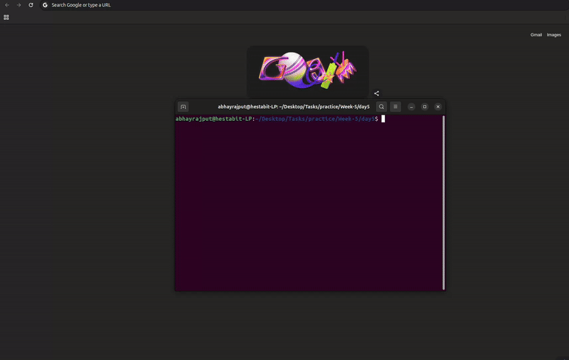

# DAY 5 - CI-Style Deployment Automation & Capstone

## Folder Structure 

```text
day5/
│
├── backend/
│   ├── Dockerfile
│   ├── index.js
│   ├── package.json
│   └── .dockerignore
│
├── client/
│   ├── Dockerfile
│   ├── index.html
│   └── .dockerignore
│
├── nginx/
│   ├── nginx.conf
│   └── certs/
│       ├── server.crt
│       └── server.key
│
├── docker-compose.yml
├── .env
└── README.md
```

## Tasks Done
- Multi Container Docker setup
- Reverse Proxy Configuration
- Https Setup

- Health check config


### Commands:

- For building and starting containers `docker compose up -d --build`

- For Stopping containers `docker compose down`
- For viewing running containers `docker ps`

- Check logs `docker logs <container-name>`

## Code:

- Health route for check (backend/index.js)

```javascript
app.get("/health", (req, res) => {
  res.status(200).json({
    status: "UP",
    service: "backend",
    hostname: os.hostname(),
    timestamp: new Date().toISOString(),
  });
});
```
- Create Note route (backend/index.js)

```javascript
app.post("/api/notes", async (req, res, next) => {
  try {
    if (!req.body.text) {
      return res.status(400).json({
        error: "Note text is required",
      });
    }

    const note = await Note.create({ text: req.body.text });

    res.status(201).json(note);
  } catch (error) {
    next(error);
  }
});
```
- Error Handling (backend/index.js)
```javascript
app.use((err, req, res, next) => {
  console.error("Server Error:", err.message);

  res.status(500).json({
    error: "Internal Server Error",
    message: err.message,
  });
});
```
- Fetch Notes (client/App.js)

```javascript
const fetchNotes = async () => {
  const res = await fetch("/api/notes");
  const data = await res.json();
  setNotes(data);
};
```
- Create Notes (client/App.js)
```javascript
await fetch("/api/notes", {
  method: "POST",
  headers: { "Content-Type": "application/json" },
  body: JSON.stringify({ text }),
});
```
## Recording 


