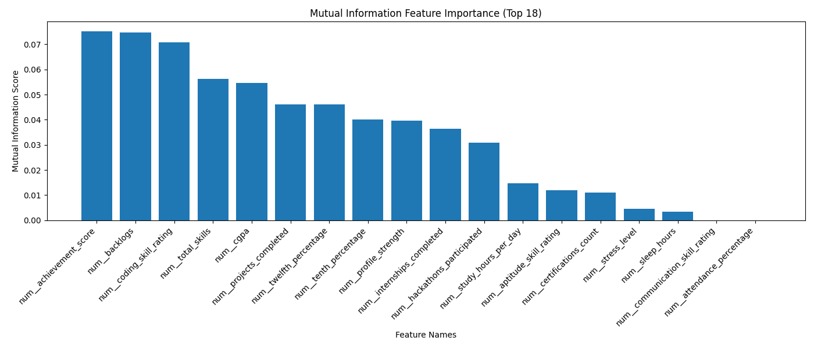

# Day 2: Feature Engineering & Selection

## Folder Structure
```text
src/
│
├── data/
│   ├── raw/
│   └── processed/
│       ├── train.csv
│       └── test.csv
│
├── features/
│   ├── build_features.py       
│   ├── custom_transformers.py  
│   ├── feature_selector.py     
│   └── feature_list.json       
│
├── models/
│   ├── feature_pipeline.pkl
│   └── feature_importance.png
│
├── training/
├── evaluation/
└── utils/
```

## Tasks Completed
- Built Processing Pipeline for Log Transformation, numeric Scaling, Categorical Encoding.
- Feature Selection
- Correlation Filter For Removing redundant features.


## Code Snippets

### Custom Feature Generation 
```python
class CustomFeatureGenerator(BaseEstimator, TransformerMixin):
    def transform(self, X):
        X = X.copy()
        
        
        if "cgpa" in X.columns and "aptitude_skill_rating" in X.columns:
            X["academic_strength"] = X["cgpa"] * X["aptitude_skill_rating"]

        
        if "cgpa" in X.columns and "study_hours_per_day" in X.columns:
            X["efficiency_score"] = X["cgpa"] / (X["study_hours_per_day"] + 1)
            
        
        return X
```

### Building the Pipeline 
```python
def build_pipeline(self, X):
    numeric_pipeline = Pipeline([
        ("log", FunctionTransformer(np.log1p, validate=False, feature_names_out="one-to-one")),
        ("scaler", StandardScaler())
    ])

    categorical_pipeline = Pipeline([
        ("onehot", OneHotEncoder(handle_unknown="ignore"))
    ])

    
    pipeline = Pipeline([
        ("feature_generation", CustomFeatureGenerator()), 
        ("preprocessing", preprocessor)                   
    ])
    return pipeline
```

### Feature Selection 
```python

corr_matrix = pd.DataFrame(X_transformed).corr().abs()
to_drop = [column for column in upper.columns if any(upper[column] > 0.9)]


rfe_selector = RFE(estimator=RandomForestClassifier(), n_features_to_select=15)
rfe_selector.fit(X_filtered, y)
```

### Feature Selection Results

Chart displays the top features selected to identify the most predictive variables.
