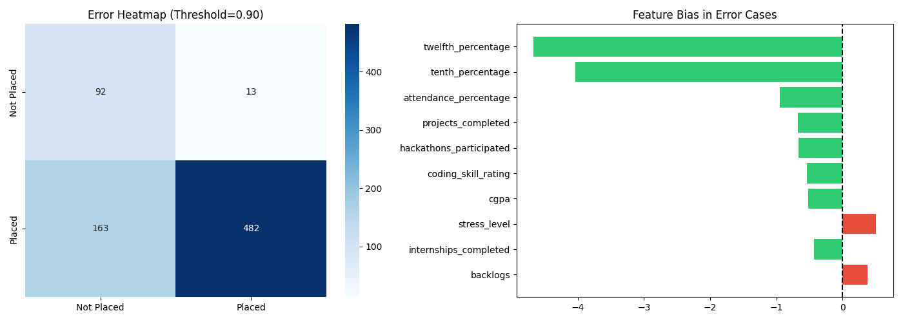

# Day 4: Hyperparameter Tuning, Explainability AND Error Analysis

## Folder Structure
```text
src/
│
├── training/
│   └── tuning.py               
│
├── evaluation/
│   ├── shap_analysis.py        
│   ├── error_analysis.py       
│   ├── shap_summary.png        
│   ├── shap_importance.png     
│   ├── feature_importance.png  
│   ├── error_heatmap.png       
│   ├── error_patterns.csv      
│   └── error_analysis_report.txt
│
├── tuning/
│   └── results.json            
│
└── models/
    ├── best_model.pkl
    └── tuned_random_forest.pkl
```

## Tasks Completed
- Hyperparameter tuning with Optuna.
- SHAP analysis: generated summary plot and global importance bar chart.
- Feature importance chart regenerated with proper feature name labels.
- Error analysis: identified False Positives and False Negatives.
- Bias/variance analysis: found which features differ most in error cases.


## Code Snippets

### Hyperparameter Tuning with Optuna
```python
def objective(self, trial, X, y):
    n_estimators = trial.suggest_int("n_estimators", 50, 300)
    max_depth    = trial.suggest_int("max_depth", 5, 30)
    min_samples_split = trial.suggest_int("min_samples_split", 2, 20)
    min_samples_leaf  = trial.suggest_int("min_samples_leaf", 1, 10)

    clf = RandomForestClassifier(
        n_estimators=n_estimators, max_depth=max_depth,
        min_samples_split=min_samples_split, min_samples_leaf=min_samples_leaf,
        random_state=42
    )
    return cross_val_score(clf, X, y, cv=3, scoring="f1").mean()

study = optuna.create_study(direction="maximize")
study.optimize(lambda trial: self.objective(trial, X, y), n_trials=20)
```

### SHAP Explainability
```python
explainer = shap.TreeExplainer(model)
shap_values = explainer.shap_values(X_test)

shap.summary_plot(shap_values, X_test, show=False)
plt.savefig("src/evaluation/shap_summary.png")

shap.summary_plot(shap_values, X_test, plot_type="bar", show=False)
plt.savefig("src/evaluation/shap_importance.png")
```

### Error Analysis + Bias/Variance
```python
results_df["error_type"] = "Correct"
results_df.loc[(actual==0) & (predicted==1), "error_type"] = "False Positive"
results_df.loc[(actual==1) & (predicted==0), "error_type"] = "False Negative"


for col in numeric_cols:
    difference = error_df[col].mean() - results_df[col].mean()
    
```

### Explainability and Error Diagnosis

Shows how high and low values of each feature influence the model's placement predictions.


Shows where the model struggles most.
