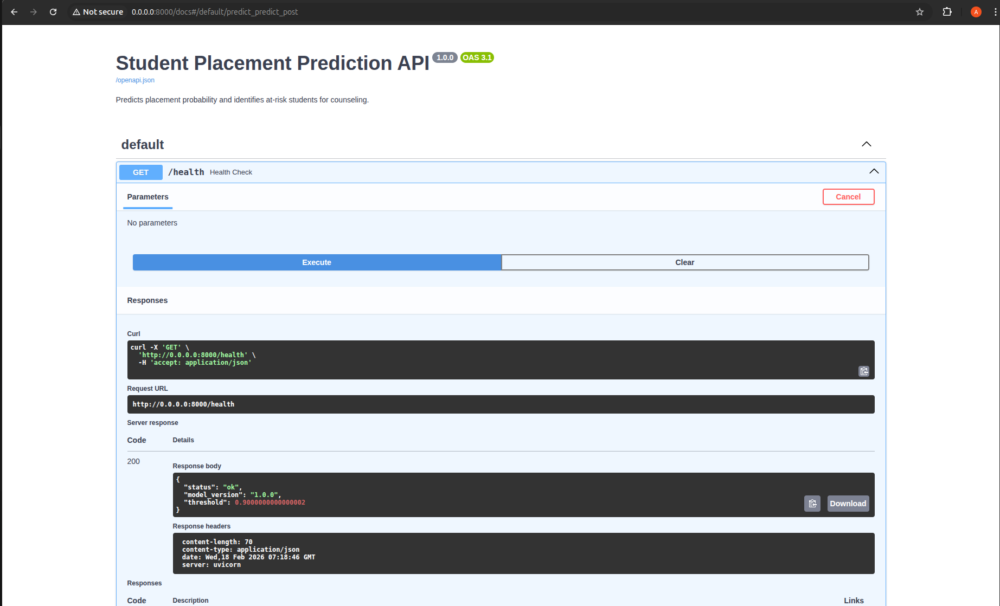
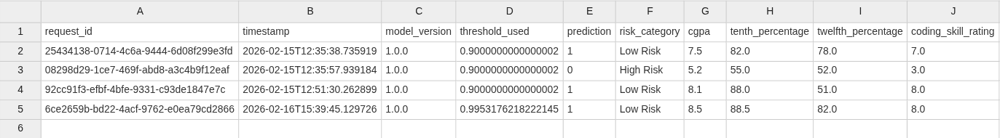

# DEPLOYMENT NOTES

## Running the API Locally

```bash

./venv/bin/python3 -m uvicorn src.deployment.api:app --host 0.0.0.0 --port 8000 --reload
```

API will be live at: `http://localhost:8000`
Interactive docs: `http://localhost:8000/docs`


## API Endpoints

### POST /predict
Accepts a student's data and returns placement prediction.

**Request Body:**
```json
{
  "cgpa": 7.5,
  "tenth_percentage": 82.0,
  "twelfth_percentage": 78.0,
  "coding_skill_rating": 7.0,
  "communication_skill_rating": 6.5,
  "aptitude_skill_rating": 7.0,
  "internships_completed": 1,
  "projects_completed": 3,
  "certifications_count": 2,
  "hackathons_participated": 1,
  "study_hours_per_day": 5.0,
  "attendance_percentage": 85.0,
  "backlogs": 0,
  "stress_level": 4.0,
  "sleep_hours": 7.0,
  "gender": "Male",
  "stream": "CSE"
}
```

**Response:**
```json
{
  "request_id": "uuid-...",
  "model_version": "1.0.0",
  "probability_of_placement": 0.8732,
  "prediction": "Placed",
  "risk_category": "Low Risk",
  "counseling_recommendation": "Low risk. Keep maintaining current performance.",
  "threshold_used": 0.9
}
```

### GET /health
Returns API health status and model version.

### GET /model-info
Returns model type, threshold, metrics, and selected features count.

## Risk Categories
| Category | Condition | Action |
||||
| **High Risk** | Probability < 54% of threshold | Immediate counseling |
| **Medium Risk** | Probability < threshold | Monitor and support |
| **Low Risk** | Probability >= threshold | No intervention needed |


## Running with Docker

```bash
# Build image
docker build -t placement-api .

# Run container
docker run -p 8000:8000 placement-api
```

## Prediction Logging
Every prediction is automatically logged to `prediction_logs.csv` with:
- `request_id` — unique UUID per request
- `timestamp` — when the prediction was made
- `model_version` — for versioned tracking
- `probability`, `prediction`, `risk_category`
- All input features (for drift monitoring)


## Design Decision

- **Threshold = 0.90** (not default 0.5): Tuned to catch 87.6% of at-risk students.
- **Pydantic validation**: All inputs validated before reaching the model.
- **Versioned loading**: `MODEL_VERSION` env var allows tracking which model made which prediction.
- **Drift detection**: KS test is statistically rigorous and non-parametric (no distribution assumptions).

### Feature Drivers

Indicators the model relies on.

### Production Model Performance

Final confusion matrix at the 0.90 threshold.

### Monitoring & Error Diagnosis

For bias detection

### API Documentation

Contains Docs for api

### Prediction Logs

Contains Logs for api
