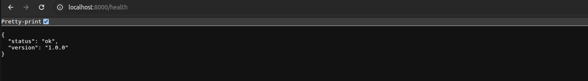
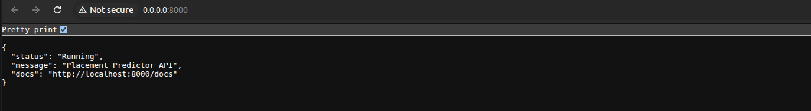

# Day 5: Model Deployment And Monitoring

## Folder Structure
```text
src/
│
├── deployment/
│   ├── api.py              
│   └── Dockerfile          
│
├── monitoring/
│   └── drift_checker.py    
│
├── models/
│   └── best_model.pkl      
│
└── evaluation/
    └── metrics.json        
│
.env.example                
prediction_logs.csv         
DEPLOYMENT-NOTES.md         
```

## Tasks Completed
- FastAPI `/predict` endpoint
- Risk categorization: High Risk / Medium Risk / Low Risk.
- Dockerfile for containerized deployment.

## Code Snippets

### POST /predict Endpoint
```python
@app.post("/predict")
async def predict(student: StudentInput, request: Request):
    request_id = str(uuid.uuid4())

    input_df = pd.DataFrame([student.dict()])
    X_transformed = pipeline.transform(input_df)
    X_final = X_df[valid_features]
    probability = float(model.predict_proba(X_final)[0][1])
    prediction = int(probability >= OPTIMAL_THRESHOLD)
    risk = get_risk_category(probability, OPTIMAL_THRESHOLD)

    log_prediction(request_id, student.dict(), probability, prediction, risk, OPTIMAL_THRESHOLD)

    return {
        "request_id": request_id,
        "probability_of_placement": round(probability, 4),
        "prediction": "Placed" if prediction == 1 else "Not Placed",
        "risk_category": risk,
        "counseling_recommendation": get_counseling_recommendation(risk, student.dict()),
    }
```

### Input Validation (Pydantic)
```python
class StudentInput(BaseModel):
    cgpa: float = Field(..., ge=0.0, le=10.0)
    backlogs: int = Field(..., ge=0)
    gender: str

    @validator("gender")
    def validate_gender(cls, v):
        if v not in ("Male", "Female"):
            raise ValueError("gender must be 'Male' or 'Female'")
        return v
```

### Drift Detection (KS Test)
```python
for col in numeric_cols:
    ks_stat, p_value = stats.ks_2samp(train_vals, pred_vals)
    drifted = p_value < 0.05

    if drifted:
        logger.warning(f"DRIFT DETECTED in '{col}': p={p_value:.4f}")
```

### Final Optimized Performance

Confusion matrix after shifting the decision threshold to 0.90.

### Health Check

Contains Health Check for api

### Root

Root path serving over browser 


