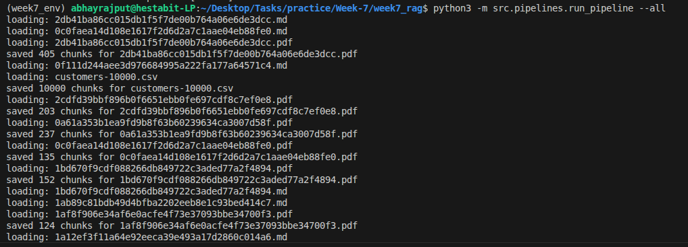
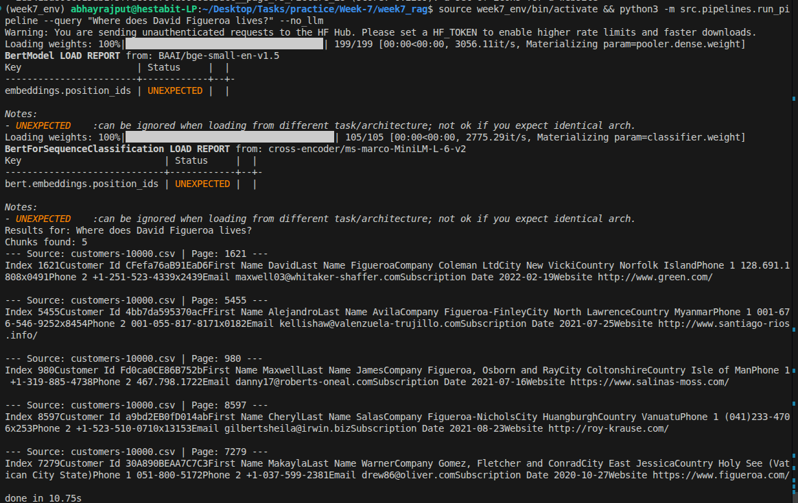

# RAG Architecture — Path A (Fully Offline)

This document outlines the architecture and design decisions for the local RAG system implemented in Week 7.

## System Overview
The system follows a modular pipeline design, processing documents from raw files to an interactive query engine.

### Pipeline Diagram
```text
[PDF/DOCX/TXT/CSV] → [Ingest] → [Chunks] → [Embedder]
         ↓                                     ↓
[rag_prompt.txt] ← [LLM API] ← [QueryEngine] ← [FAISS Index]
```

## Why Path A (Local)?
- **Zero Cost:** No API credits or subscriptions required.
- **Privacy:** Your documents and queries never leave your machine.
- **Offline:** Works without internet after the initial model download.
- **CPU Optimized:** Designed to run efficiently on modern CPUs without requiring a dedicated GPU.

## Model Details
### Main LLM
- **Model:** Mistral-7B-Instruct-v0.2
- **Format:** GGUF (Quantized)
- **Download:** [HuggingFace - TheBloke](https://huggingface.co/TheBloke/Mistral-7B-Instruct-v0.2-GGUF)
- **File:** `mistral-7b-instruct-v0.2.Q5_0.gguf` (or similar)
- **Placement:** `src/models/`

### Embedding Model
- **Model:** `BAAI/bge-small-en-v1.5`
- **Size:** ~130 MB
- **Device:** CPU (Sentence-Transformers)

## Folder Structure (Day 1)
- `src/data/raw/`: Input documents.
- `src/data/chunks/`: Intermediate JSON chunks with metadata.
- `src/data/embeddings/`: Saved `.npy` vector files.
- `src/vectorstore/`: FAISS index and metadata.
- `src/generator/`: LLM API client logic (connects to OpenRouter/Gemini).
- `src/retriever/`: Search and RAG answering logic.
- `src/pipelines/`: Orchestration and ingestion scripts.

## Configuration (`model.yaml`)
- `llm_model_path`: Relative path to your GGUF file.
- `chunk_size`: 600 tokens (optimized for context window).
- `n_gpu_layers`: Always `0` for CPU-only inference.

## How to Run
1. **Setup:** `pip install -r requirements.txt`
2. **Ingest & Index:** `python3 -m src.pipelines.run_pipeline --all`
3. **Query:** `python3 -m src.pipelines.run_pipeline --query "Your question"`

## Chunking Strategy
We use `RecursiveCharacterTextSplitter` with `tiktoken` counting. 
- **Size:** 600 tokens ensures enough context for the LLM while avoiding truncation.
- **Overlap:** 100 tokens prevents loss of meaning at chunk boundaries.

## Testing without GGUF
If you haven't downloaded the 4GB model yet, you can still test retrieval:
`python3 -m src.retriever.query_engine --query "test" --no-llm`

## Common Errors
- **FileNotFound (GGUF):** Ensure the path in `model.yaml` matches your downloaded file.
- **ImportError (llama-cpp):** Ensure you installed with `CMAKE_ARGS="-DLLAMA_CUBLAS=off"`.
- **Memory Error:** If the 7B model is too heavy, try a `Q4_K_M` or `Q2` quantization.

## Step-by-Step Ingestion Pipeline
1. **Document Loading:** `ingest.py` reads user files (PDF, CSV, etc) from the `raw/` directory.
2. **Text Chunking:** Files are processed and split into smaller 600-word blocks using `text_utils.py`.
3. **Embedding Generation:** `embedder.py` converts these blocks into numerical arrays using `BGE-small-en-v1.5`.
4. **FAISS Indexing:** `vector_manager.py` loads the numerical arrays and indexes them for hyper-fast semantic search.

## Code Snippet
**Text Chunking Configuration:**
```python
# simple character splitting configured via model.yaml
chunk_size = 600
chunk_overlap = 100
```

## Commands
Make sure your API key is configured.
```bash
# Activate virtual environment
source week7_env/bin/activate

# Ingest new documents and update FAISS index
python3 -m src.pipelines.run_pipeline --all

# Search the index and generate an answer
python3 -m src.pipelines.run_pipeline --query "What is the primary document about?"
```

## Screenshots



