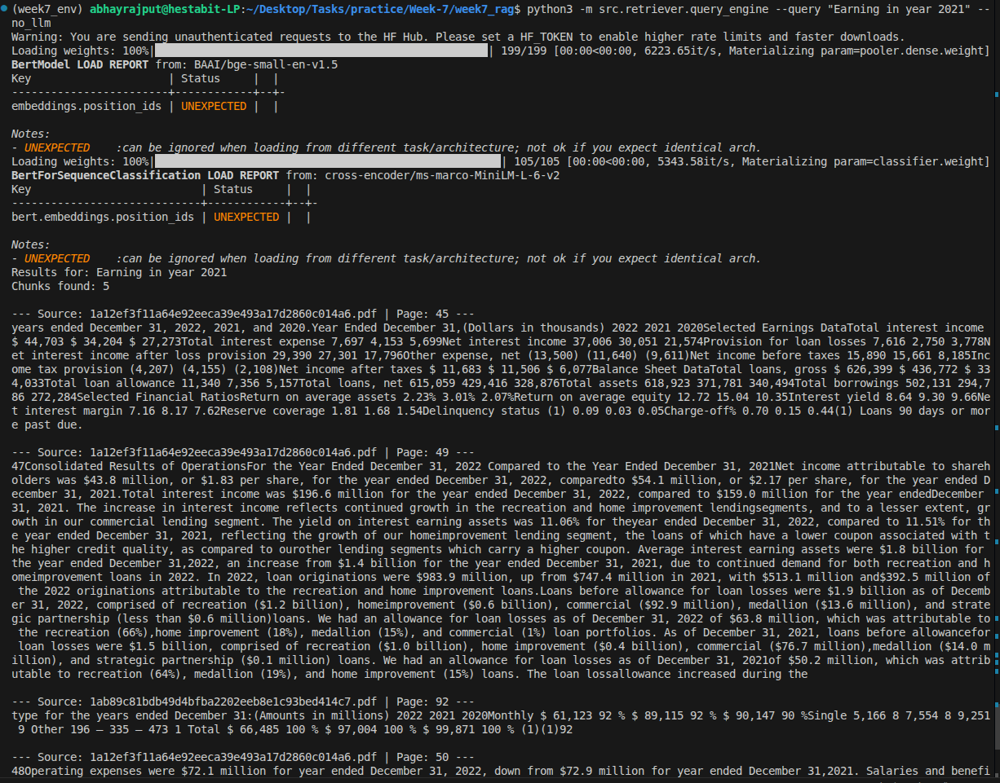

# Day 2: Advanced Retrieval Implementation Summary

## Folder Structure
```text
week7_rag/
├── RETRIEVAL-STRATEGIES.md
├── src/
│   ├── evaluation/
│   │   └── retrieval_eval.py
│   ├── pipelines/
│   │   ├── context_builder.py
│   │   └── run_pipeline.py
│   ├── retriever/
│   │   ├── bm25_index.py
│   │   ├── hybrid_retriever.py
│   │   └── reranker.py
│   └── vectorstore/
│       ├── index.faiss
│       └── bm25_index.pkl
```

## Tasks Done
- BM25 a keyword-based search index.
- Combined FAISS and BM25.
- scripts to measure Precision, Recall, and MRR.


## Components
- `src/retriever/bm25_index.py`: Keyword search logic.
- `src/retriever/hybrid_retriever.py`: Vector and Keyword fusion.
- `src/retriever/reranker.py`: CPU-based reranking and MMR.
- `src/pipelines/context_builder.py`: Pipeline coordinator for retrieval.
- `src/evaluation/retrieval_eval.py`: Metrics.


## Code Snippet
**Hybrid Retrieval:**
```python
class HybridRetriever:
    # semantic vector search with keyword exact-match 
    def retrieve(self, query: str, top_k=5, filters=None):
        sem_res = self.vector_retriever.search(query, k=top_k*2, filters=filters)
        bm25_res = self.bm25.search(query, k=top_k*2)
        
        return self._rrf(sem_res, bm25_res)[:top_k]
```

## Commands
```bash
# Query for Hybrid text fetching
source week7_env/bin/activate
python3 -m src.retriever.query_engine --query "Explain the pricing models" --no_llm
```


```bash
# Query with LLM generating a natural language answer from the hybrid context
python3 -m src.retriever.query_engine --query "Earnings in year 2021?"
```

