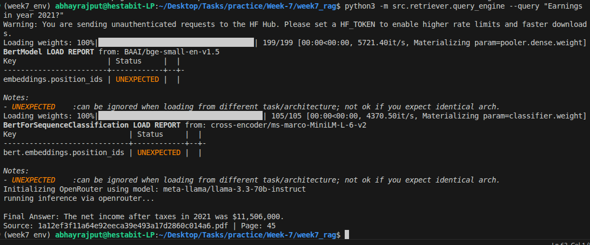

# Retrieval Strategies — Advanced RAG

This document explains the advanced retrieval techniques implemented on Day 2.

## 1. Folder Structure (Day 2)
- `bm25_index.py`: Manages finding matching words exactly.
- `hybrid_retriever.py`: Combines keyword and semantic search results using RRF.
- `reranker.py`: Uses a heavier model to finely sort the search results.
- `context_builder.py`: Organizes the final combined text into one neat block for the LLM.
- `query_engine.py`: Takes the formatted context block and sends it to the API.
- `retrieval_eval.py`: Helps score how good our search methods are working.

## 2. Hybrid Retrieval (Semantic + Keyword)
Semantic search (FAISS) is great for concepts but weak for specific keywords or codes. BM25 (Keyword) is the opposite. Fusing them gives the best of both worlds.

### What is actually happening? (Layman Terms)
When you ask for a "red shoe", the Semantic search might bring back "crimson sneaker" because they mean the same thing. However, if you are looking for an exact product name like "Model X12", semantic search might fail. Keyword search acts like a classic Google search, looking for the exact word match. Hybrid retrieval simply runs both searches at the same time and pools the best results together.

### RRF (Reciprocal Rank Fusion)
We combine the ranks from both methods using the formula:
`Score = weight1 / (rank1 + 60) + weight2 / (rank2 + 60)`
This ensures that chunks appearing at the top of either list get a high combined score.

## 3. Re-ranking (Cross-Encoder)
Bi-encoders (BGE) represent text as single vectors, which is fast but loses nuance. Cross-encoders (MS-MARCO) look at the query and document together to get a high-accuracy relevance score.
- **Usage:** Retrieve 20 candidates → Rerank top 5.

### What is actually happening? (Layman Terms)
The earlier hybrid search is very fast but acts like a quick skim-reader. The cross-encoder reranker acts like a slow, careful reader who takes the top 20 results the skimmer found, reads them deeply against your exact question, and carefully grades them 1-10 to put the very best ones at the top before handing them to the LLM.

## 4. MMR (Max Marginal Relevance)
MMR prevents "answer repetition" by penalizing candidates that are too similar to those already selected for the context. It balances **Relevance** vs **Diversity**.

## 5. Metadata Filtering
Using pre-filtering or post-filtering (implemented as post-filtering here) allows you to restrict the search to specific document types or sources.

## 6. Fallback Strategy
If high-precision methods (Hybrid) fail to find enough results, the system falls back to a simple substring search across the entire corpus to ensure the user gets *some* relevant context.

## 7. Performance on CPU
- **BM25:** Extremely light (milliseconds).
- **Reranking:** Heavier (~100-500ms for 20 chunks on CPU).
- **MMR:** Moderate complexity (numpy based).

## Context Builder Integration
The `ContextBuilder` aggregates everything. It takes the text fragments returned from `HybridRetriever`, sends them through `Reranker`, and then stitches them into a solid block of text separated by `--- Source ---` tags. The `QueryEngine` then wraps this completely processed context into a final prompt (using `rag_prompt.txt`) before injecting it into the LLM API.

## Code Snippet
**Query Engine Retrieval without LLM:**
```python
# retrieve raw context explicitly to see what the LLM will see
res_dict = engine.retrieve(args.query)
print(f"Chunks found: {res_dict['num_chunks']}\\n")
print(res_dict['context'])
```

## Commands
```bash
source week7_env/bin/activate
# Test the Context Builder and Hybrid Retrieval without hitting the API
python3 -m src.retriever.query_engine --query "Explain the pricing models" --no_llm
```

## Screenshots

