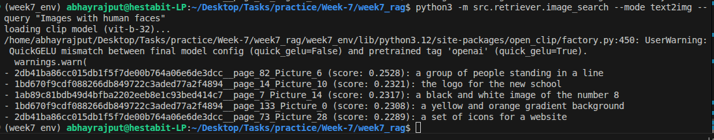

# Day 3: Multimodal RAG Implementation Summary

## Folder Structure
```text
week7_rag/
├── MULTIMODAL-RAG.md
├── src/
│   ├── data/
│   │   └── images/
│   │       ├── raw/         
│   │       ├── processed/   
│   │       ├── ocr/          
│   │       └── captions/     
│   ├── embeddings/
│   │   ├── clip_embedder.py
│   │   └── embedder.py
│   ├── pipelines/
│   │   ├── image_ingest.py
│   │   └── run_pipeline.py
│   ├── retriever/
│   │   ├── image_search.py
│   │   └── query_engine.py
│   └── vectorstore/
│       ├── image_index.faiss
│       └── image_metadata.json
```

## Tasks Done
- OCR for text extraction from images.
- BLIP for Captioning images in natural language.
- CLIP Embeddings for mapping text and images.
- Image FAISS Store for visual search.
- Visual RAG with Text-to-Image, Image-to-Image, and Image-to-Answer modes.

## Code Snippet
**Image to Answer Pipeline:**
```python
class ImageSearchEngine:
    # answers a text question using the visual context from an image
    def image_to_answer(self, img_path, question):
        results = self.image_to_image(img_path, top_k=3)
        if not results: return "no visual context found."
        
        ctx = "\\n".join([f"Image: {r['image_id']}\\nCaption: {r['caption']}" for r in results])
        full_ctx = f"[MULTIMODAL CONTEXT]\\n{ctx}"
        return self.llm.generate(template.format(context=full_ctx, query=question))
```

## Commands

```bash
source week7_env/bin/activate
# Test Text to Image matching
python3 -m src.retriever.image_search --mode text2img --query "Images with human faces"
```


```bash
# Test asking a visual question based on an image using the API
python3 -m src.retriever.image_search --mode img2ans --image src/data/images/raw/1bd670f9cdf088266db849722c3aded77a2f4894/_page_18_Figure_1.jpeg --query "What is in this image?"
```
