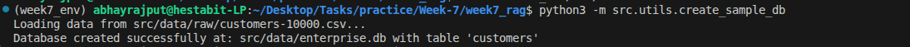
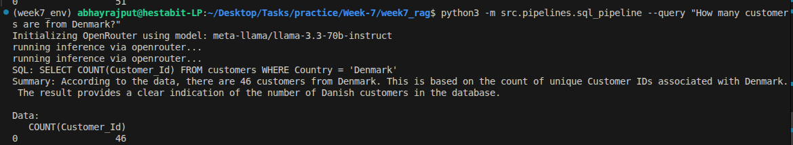
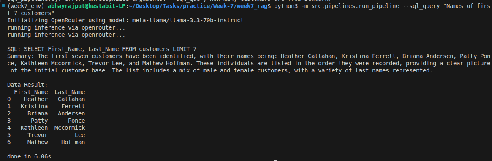

# Day 4: SQL Question Answering Implementation Summary

## Folder Structure
```text
week7_rag/
├── SQL-QA-DOC.md            
├── src/
│   ├── generator/
│   │   └── sql_generator.py  
│   ├── pipelines/
│   │   └── sql_pipeline.py   
│   ├── prompts/
│   │   └── sql_prompt.txt    
│   └── utils/
│       ├── create_sample_db.py 
│       ├── schema_loader.py    
│       └── sql_validator.py    
```

## Tasks Done
- Loaded customer data (10,000 rows) from `customers-10000.csv` into `enterprise.db` as the `customers` table.
- SQL Validator to ensure only read-only SELECT queries run.
- Results are converted from raw tables back into friendly natural language.


## Code Snippet

```python
class SQLQAPipeline:
    def __init__(self, db_path='src/data/enterprise.db'):
        # Read-only
        self.engine = create_engine(
            f'sqlite:///file:{db_path}?mode=ro&uri=true',
            connect_args={'check_same_thread': False}
        )
```

## Commands

```bash
source week7_env/bin/activate
# Build DB from CSV (run once)
python3 -m src.utils.create_sample_db
```


```bash
# NLP query
python3 -m src.pipelines.sql_pipeline --query "How many customers are from Denmark?"
```


```bash
# SQL query
python3 -m src.pipelines.run_pipeline --sql_query "Names of first 7 customers"
```
