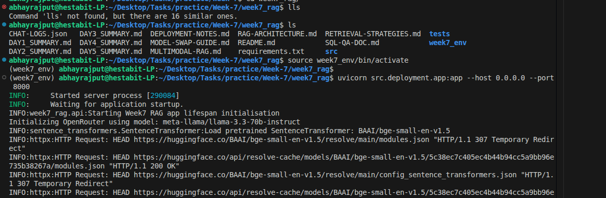
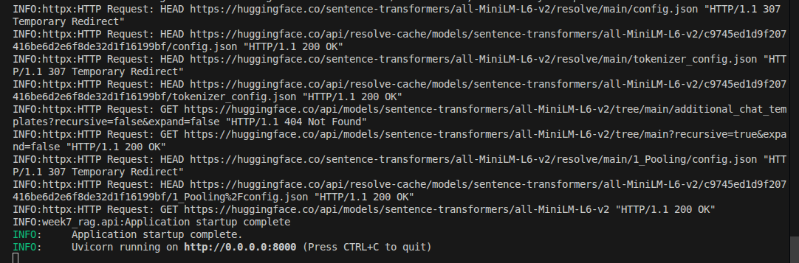
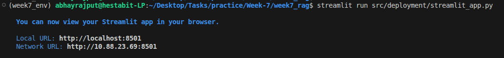

# Day 5: Memory, Evaluation, API And UI

## Folder Structure
```text
week7_rag/
├── CHAT-LOGS.json         
├── DEPLOYMENT-NOTES.md    
├── src/
│   ├── deployment/
│   │   ├── app.py           
│   │   └── streamlit_app.py 
│   ├── evaluation/
│   │   ├── rag_eval.py      
│   │   └── self_reflect.py  
│   └── memory/
│       └── memory_store.py  
└── tests/
    └── test_integration.py  
```

## Completed Tasks
- FastAPI for `/ask`, `/ask-image`, and `/ask-sql` endpoints.
- Memory Store to maintain context window.
- Evaluation for `faithfulness` and `hallucination_flag` scores locally.

## Commands

- **Terminal 1:** Run `source week7_env/bin/activate && uvicorn src.deployment.app:app`
- **Terminal 2:** Run `source week7_env/bin/activate && streamlit run src.deployment.streamlit_app.py`

## Code Snippet
**FastAPI Lifespan (Loading components only once):**
```python
@asynccontextmanager
async def lifespan(app: FastAPI):
    # load all ai models into memory once when server starts
    logger.info("Starting Week7 RAG app lifespan initialisation")

    llm_client = LocalLLMClient()
    embedder = Embedder()
    vector_manager = VectorStoreManager()
    vector_manager.load()
    
    app.state.llm_client = llm_client
    app.state.embedder = embedder
    yield
```

## Commands

```bash
# Terminal 1 - API Backend
source week7_env/bin/activate
uvicorn src.deployment.app:app --host 0.0.0.0 --port 8000
```



```bash
# Terminal 2 - Streamlit UI
source week7_env/bin/activate
streamlit run src.deployment.streamlit_app.py
```


## Screenshots


