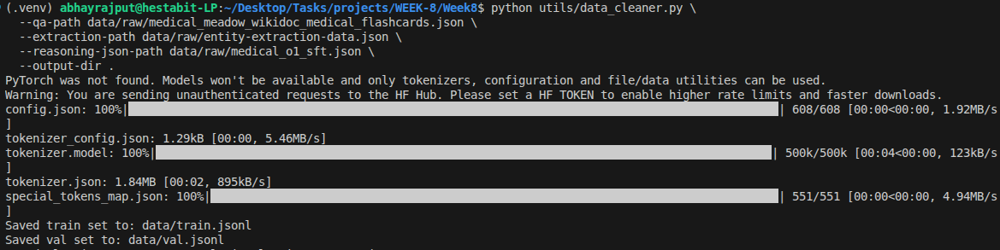
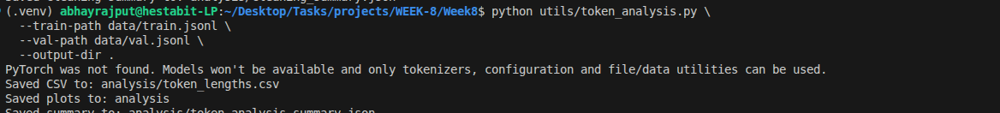

# Day 1: LLM Architecture And Data Preparation

## Folder Structure
```text
/data
├── train.jsonl             
└── val.jsonl               
/utils
├── data_cleaner.py         
└── token_analysis.py       
/reports
└── DATASET-ANALYSIS.md     
```

## Tasks Completed
- Instruction Dataset Design: Built a diverse medical instruction tuning dataset containing three types of samples: QA (500), Reasoning (500), and Extraction (500) for the training set.
- Data Cleaning: Implemented a deduplication and cleaning pipeline in `data_cleaner.py` to ensure high-quality training data.
- Outlier Removal: Performed IQR-based token length analysis to identify and remove outliers, maintaining a consistent training signal.
- Tokenizer Alignment: Used the `TinyLlama` tokenizer to analyze sample lengths and ensure they fit within the model's context window.

## Important Code Snippet (Deduplication & IQR)
```python
def dedupe_rows(rows: list[dict[str, str]]) -> list[dict[str, str]]:
    seen = set()
    cleaned = []
    for row in rows:
        key = (row["instruction"].strip(), row["input"].strip(), row["output"].strip())
        if key not in seen:
            seen.add(key)
            cleaned.append(row)
    return cleaned

def iqr_bounds(values: list[int]) -> tuple[float, float]:
    ordered = sorted(values)
    q1 = ordered[len(ordered) // 4]
    q3 = ordered[(3 * len(ordered)) // 4]
    iqr = q3 - q1
    return q1 - 1.5 * iqr, q3 + 1.5 * iqr
```

## Screenshots


