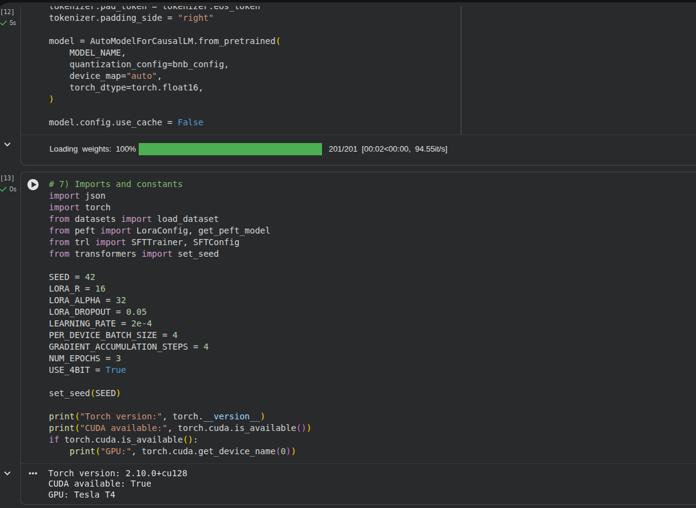

# Day 2: Parameter-Efficient Fine-Tuning (LoRA / QLoRA)

## Folder Structure
```text
/notebooks
└── lora_train.ipynb        
/adapters
├── adapter_model.bin       
└── adapter_config.json     
/reports
└── TRAINING-NOTES.md       
```

## Tasks Completed
- QLoRA Integration: Configured 4-bit quantization using `bitsandbytes` to fine-tune the 1.1B model on consumer-grade hardware (T4 GPU).
- LoRA Configuration: Set rank $r=16$ and $\alpha=32$, targeting all linear modules (q_proj, v_proj, etc.) for optimal performance.
- Training Pipeline: Managed the full training loop using `SFTTrainer` from the `trl` library, achieving a significant loss reduction over 3 epochs.
- Parameter Efficiency: Successfully restricted trainable parameters to ~2% of the total model size, drastically reducing memory overhead.

## Code Snippet (QLoRA Config)
```python
bnb_config = BitsAndBytesConfig(
    load_in_4bit=True,
    bnb_4bit_quant_type="nf4",
    bnb_4bit_use_double_quant=True,
    bnb_4bit_compute_dtype=torch.float16,
)

peft_config = LoraConfig(
    r=16,
    lora_alpha=32,
    lora_dropout=0.05,
    task_type="CAUSAL_LM",
    target_modules=["q_proj", "k_proj", "v_proj", "o_proj", "gate_proj", "up_proj", "down_proj"],
)
```

## Screenshots



