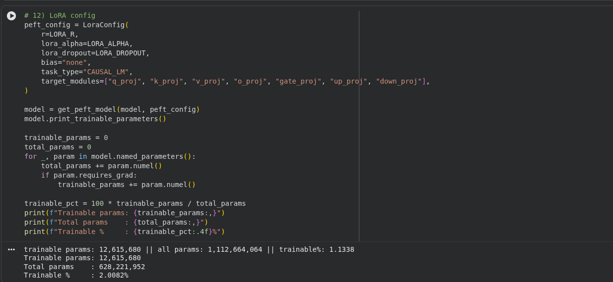
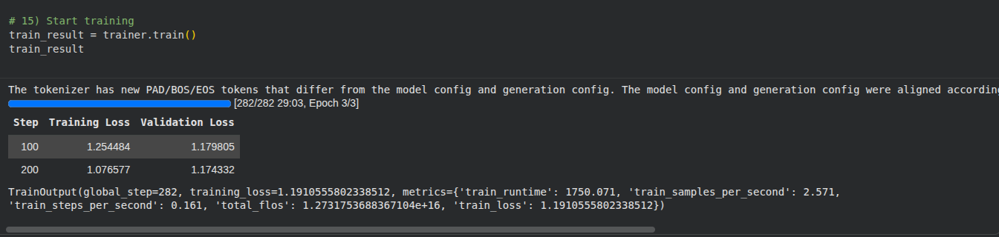

# Training Report


## Workflow
1. Environment Setup: Install dependencies including `peft`, `bitsandbytes`, and `accelerate`.
2. Model Loading: Initialize the base model with 4-bit quantization (NF4).
3. LoRA Configuration: Define the `LoraConfig` with rank 16 and target attention/MLP layers.
4. Adapter Integration: Attach LoRA adapters to the base model using `get_peft_model`.
5. Execution: Run the training notebook to fine-tune the model on cleaned medical data.

## Flow Diagram
```text
Base Model --> Load in 4-bit NF4 --> Configure PEFT/LoRA
                                            |
                                    Target Modules (q,v,k,o)
                                            |
                                    lora_train.ipynb
                                            |
                                     Training Process
                                            |
                                   adapter_model.bin
```

## Files Involved
- `notebooks/lora_train.ipynb`: Jupyter notebook for the training pipeline.
- `adapters/adapter_model.bin`: Saved LoRA weights.
- `adapters/adapter_config.json`: Metadata for the PEFT configuration.

## Commands Run
Environment setup and dependencies:
```bash
pip install torch transformers peft trl bitsandbytes accelerate
```

## Hyperparameters
- **Rank (r)**: 16
- **Alpha**: 32
- **Dropout**: 0.05
- **Optimizer**: AdamW (8-bit)
- **Batch Size**: 4
- **Precision**: 4-bit (NF4)

## LoRA Implementation Snippet
```python
peft_config = LoraConfig(
    r=16,
    lora_alpha=32,
    target_modules=["q_proj", "v_proj", "k_proj", "o_proj", "gate_proj", "up_proj", "down_proj"],
    lora_dropout=0.05,
    bias="none",
    task_type="CAUSAL_LM",
)
model = get_peft_model(model, peft_config)
model.print_trainable_parameters()
```
## Screenshots



