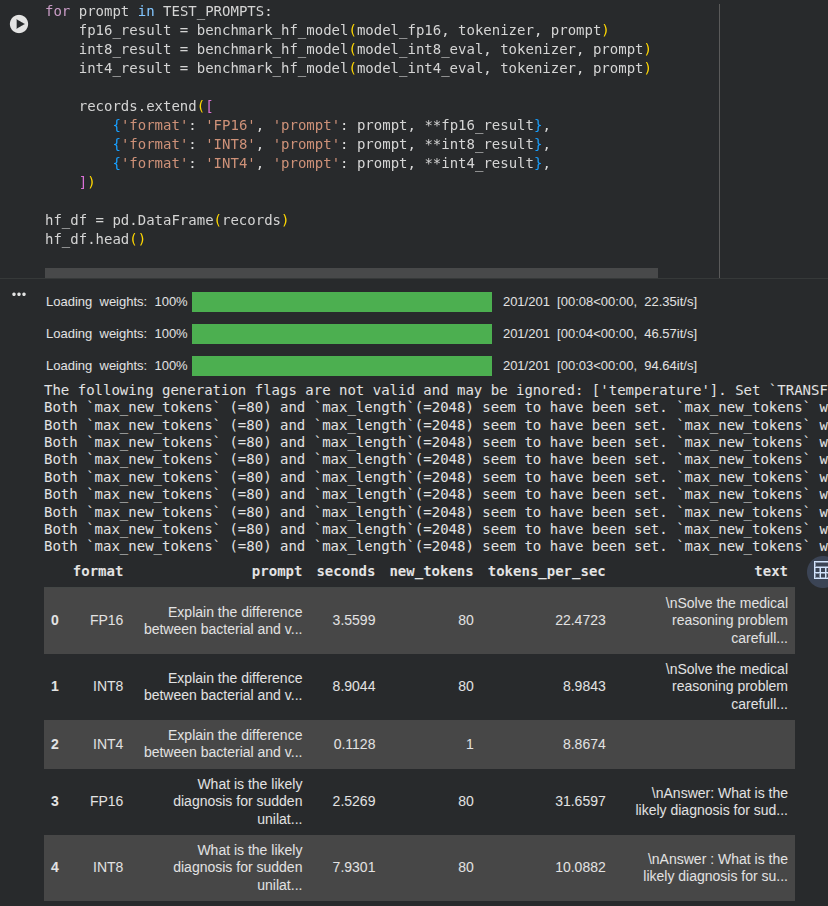
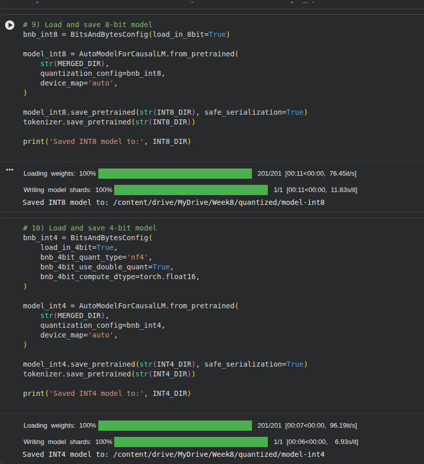

# Quantisation Report

For checking for models kindly go to this link: https://drive.google.com/drive/folders/1SylEVdlBRL4IVkiVSGnDfZJkdtm47HeY?usp=drive_link

## Workflow
1. Model Preparation: Consolidate the merged FP16 model and HuggingFace-quantized versions.
2. Analysis: Measure the original model size and define target formats (INT8, INT4, GGUF).
3. Conversion: Utilize `convert_hf_to_gguf.py` for standardizing onto a single GGUF artifact.
4. Benchmarking: Compare byte-size across all quantized formats for production viability.
5. Distribution: Store final GGUF and INT8/INT4 models in standardized directories.

## Flow Diagram
```text
Merged FP16 Model --+--> HF Quantization (INT8) ----> Size Comparison
                    |                                       ^
                    +--> HF Quantization (INT4) ------------+
                    |                                       |
                    +--> llama.cpp (convert_hf_to_gguf.py) --+
                                    |
                             model.gguf (Q4_0)
```

## Files Involved
- `quantized/model.gguf`:stand-alone GGUF model file.
- `quantized/model-int8/`: HF-quantized 8-bit model.
- `quantized/model-int4/`: HF-quantized 4-bit model.

## Model Comparision

| Format | Format Path | Size (MB) | Size (GB) | Production Status |
| :--- | :--- | :--- | :--- | :--- |
| **INT8** | `quantized/model-int8` | 1179.19 | 1.1515 | Generated |
| **INT4** | `quantized/model-int4` | 730.59 | 0.7135 | Generated |
| **GGUF (q4_0)** | `quantized/model.gguf` | 607.23 | 0.5930 | Generated |

## Commands Run
To convert the merged FP16 model to GGUF format for llama.cpp:
```bash
python3 llama.cpp/convert_hf_to_gguf.py models/merged_fp16 \
    --outfile quantized/model.gguf \
    --outtype q4_0
```

## Format Comparison Snippet
```python
# Measuring model size in GB
import os
size_f16 = os.path.getsize("models/merged_fp16/model.safetensors") / (1024**3)
size_gguf = os.path.getsize("quantized/model.gguf") / (1024**3)
print(f"FP16: {size_f16:.2f} GB | GGUF Q4: {size_gguf:.2f} GB")
```

## Screenshots



