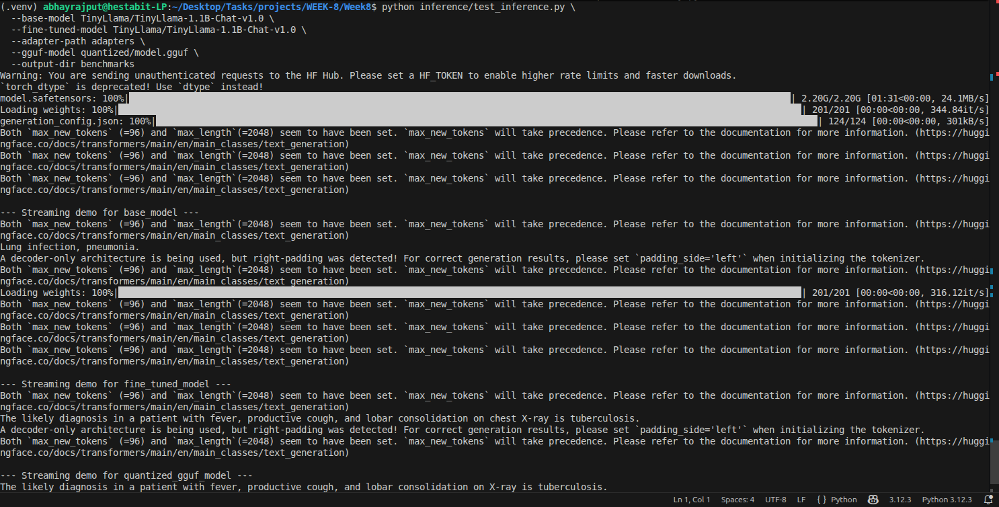

# Benchmark Report

This report presents performance metrics for various model versions.

## Workflow
1. Tool Creation: Develop `inference/test_inference.py` for comparative analysis.
2. Benchmark Execution: Test models (Base, Fine-tuned, GGUF) on a standardized prompt set.
3. Data Collection: Record Tokens per Second (TPS), Time to First Token (TTFT), and VRAM usage.
4. Accuracy Verification: Evaluate medical responses against pre-defined keywords for correctness.
5. Final Reporting: Export all performance metrics into `benchmarks/results.csv`.

## Flow Diagram
```text
Model Variants (Base, FT, GGUF) --> test_inference.py
                                        |
                                Benchmark Suite Run
                                /       |       \
                             TPS      TTFT     VRAM
                                \       |       /
                                 +--results.csv--+
```

## Files Involved
- `benchmarks/results.csv`: Table of latency and throughput benchmarks.
- `inference/test_inference.py`: Automated performance testing script.

## Commands Run
To execute the benchmark suite across all model types:
```bash
python3 inference/test_inference.py \
    --base-model TinyLlama/TinyLlama-1.1B-Chat-v1.0 \
    --fine-tuned-model TinyLlama/TinyLlama-1.1B-Chat-v1.0 \
    --adapter-path adapters/ \
    --gguf-model quantized/model.gguf
```

## Key Metrics Measured
- **TPS**: Tokens per Second (Throughput).
- **TTFT**: Time to First Token (Latency).
- **VRAM**: Peak GPU memory allocation.
- **Accuracy**: Keyword-based response evaluation.

## Performance Code Snippet
```python
start = time.perf_counter()
output = llm.generate(**inputs, max_new_tokens=96)
latency = time.perf_counter() - start
tokens_generated = output.shape[-1] - inputs["input_ids"].shape[-1]
tps = tokens_generated / latency
```

## Screenshots

