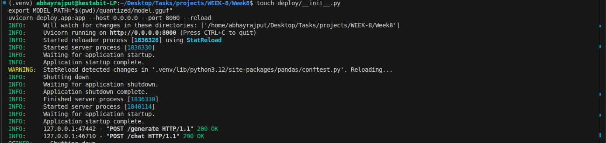
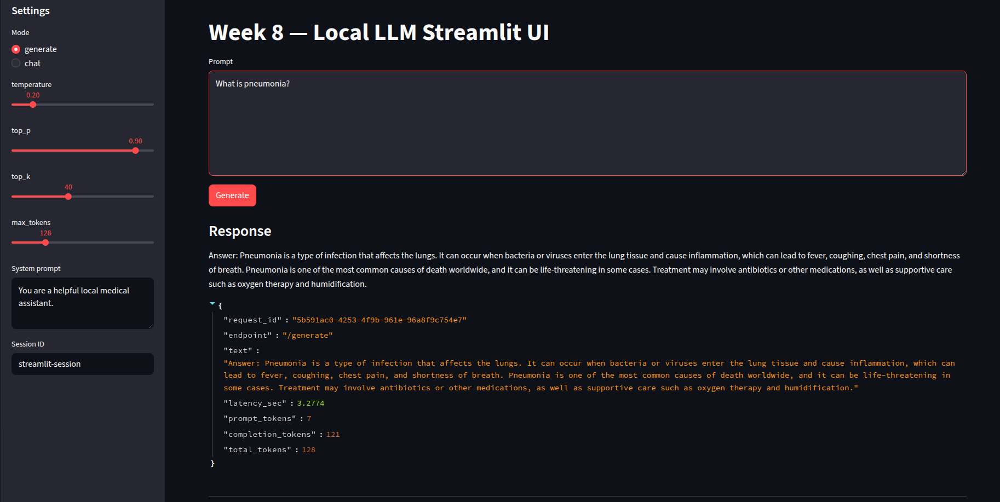

# Final Report: Local LLM Deployment

## Workflow
1. API Development: Develop a production-ready FastAPI inference server at `deploy/app.py`.
2. Model Management: Implement an efficient singleton loader in `deploy/model_loader.py`.
3. Frontend Implementation: Design an interactive evaluation UI using Streamlit.
4. Containerization: Define deployment instructions in a `DOCKERFILE`.
5. Deployment Execution: Launch the API via `uvicorn` and the UI via `streamlit` in a production environment.

## Flow Diagram
```text
FT GGUF Model --> model_loader.py --> FastAPI (app.py) --> /generate
                                                                ^
                                                                |
                                        Streamlit UI -----------+
                                                                |
DOCKERFILE --> Containerized Image --> Local/Cloud Deployment --+
```

## Files Involved
- `deploy/app.py`: FastAPI server for inference.
- `deploy/model_loader.py`: Efficient singleton for model management.
- `streamlit_app.py`: Interactive user interface.
- `DOCKERFILE`: Containerization instructions.

## Commands Run
To launch the production API:
```bash
uvicorn deploy.app:app --host 0.0.0.0 --port 8000
```
To run the evaluation UI:
```bash
streamlit run streamlit_app.py
```

## Implementation Highlights (FastAPI)
```python
@app.post("/generate")
def generate(req: GenerateRequest):
    llm = get_model()
    output = llm(req.prompt, max_tokens=req.max_tokens, temperature=req.temperature)
    return {"text": output["choices"][0]["text"].strip()}
```

## Screenshots


