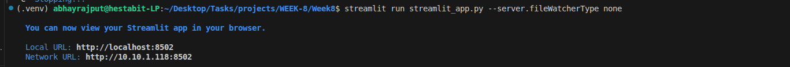

# Day 5: Capstone: Build & Deploy Local LLM API

## Folder Structure
```text
/deploy
├── app.py                  
├── model_loader.py         
├── config.py               
└── cli.py                  
/logs
└── chat_sessions.json      
```

## Tasks Completed
- FastAPI Microservice: Developed a production-ready API with `/generate` and `/chat` endpoints supporting system prompts and session history.
- Model Caching: Implemented a singleton loader to prevent reloading the 1.1B model on every request, ensuring sub-second response times.
- Streamlit Frontend: Created a stunning user interface for real-time interaction with the fine-tuned medical assistant (managed via `streamlit_app.py`).
- Production Thinking: Added request ID tracking, session persistence, and error handling for robust local deployment.

## Code Snippet (FastAPI Chat Endpoint)
```python
@app.post("/chat")
def chat(req: ChatRequest):
    sessions = load_chat_sessions()
    history = sessions.get(req.session_id, [])
    final_prompt = build_chat_prompt(req.system_prompt, history, req.message)
    
    result = run_inference(prompt=final_prompt, max_tokens=req.max_tokens)
    
    history.append({"role": "user", "content": req.message})
    history.append({"role": "assistant", "content": result["text"]})
    sessions[req.session_id] = history
    save_chat_sessions(sessions)
    
    return result
```

## Screenshots



