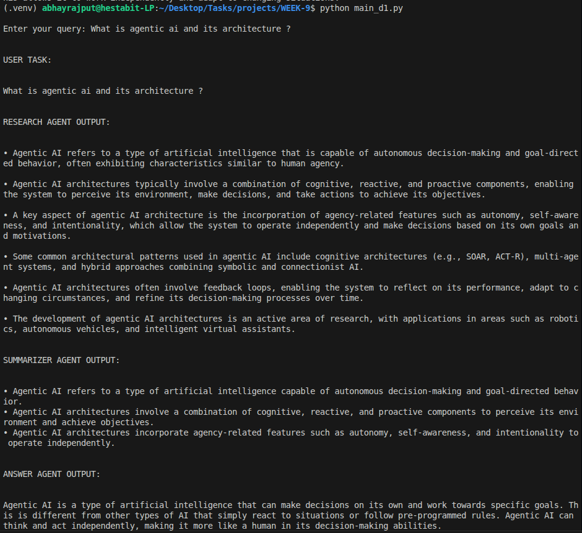

# AGENT FUNDAMENTALS

Build three single agents using Microsoft AutoGen custom agents:

1. Research Agent
2. Summarizer Agent
3. Answer Agent

Each agent has:

- a unique role
- a unique system prompt
- a memory window of 10
- strict job separation

The communication flow is:

User → Research Agent → Info  
Research Agent → Summarizer Agent → Summary  
Summarizer Agent → Answer Agent → Final Answer

---

## What is an AI Agent?

An AI agent is a software component that receives input, reasons about it, and produces an output or action.

A simple loop is:

Perception → Reasoning → Action

- **Perception**: receive a user message or another agent's message
- **Reasoning**: interpret the message according to the agent's role and instructions
- **Action**: return an output for the next step

---

## Agent vs Chatbot vs Pipeline

### Agent
An agent has a defined role, instructions, and bounded behavior. It can participate in a larger system through message passing.

### Chatbot
A chatbot mainly responds directly to users in conversation. It may not have role separation or task boundaries.

### Pipeline
A pipeline is a fixed sequence of processing steps. It is structured, but usually less adaptive than an agent-based system.

---

## Role Isolation

Role isolation means each agent handles only one responsibility.

- **Research Agent** gathers research notes
- **Summarizer Agent** compresses research into a concise summary
- **Answer Agent** produces the final answer

This reduces role confusion and makes the system easier to debug and extend.

---

## Message-Based Communication

1. The user sends a query to the Research Agent
2. The Research Agent returns research notes
3. The Summarizer Agent receives those notes and returns a concise summary
4. The Answer Agent receives the summary and returns the final answer

This is a simple message protocol system.

---

## ReAct Pattern

ReAct means Reason + Act.

- **Reason**: each agent interprets the incoming message using its system prompt
- **Act**: each agent produces a role-specific output

---

## AutoGen Pattern Used

These agents are implemented as custom AutoGen agents using the `BaseChatAgent` pattern.

Each agent implements:

- `produced_message_types`
- `on_messages`
- `on_reset`

- Memory Window = 10

Each agent stores only the latest 10 messages in memory.

This provides short-term conversational context while preventing uncontrolled prompt growth.

---

## Code Snippet
```python
# Custom Agent message handling
async def on_messages(self, messages: list[ChatMessage], cancellation_token: CancellationToken) -> Response:
    # Agent logic with role-specific system prompt and memory window
    # ...
    return Response(chat_message=TextMessage(content=output, source=self.name))
```

## Screenshots

