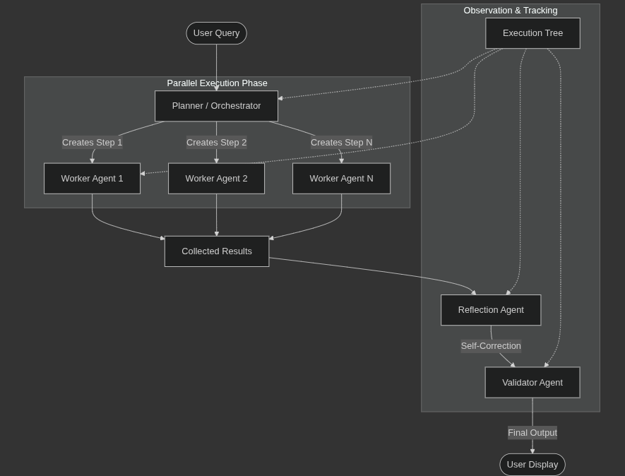
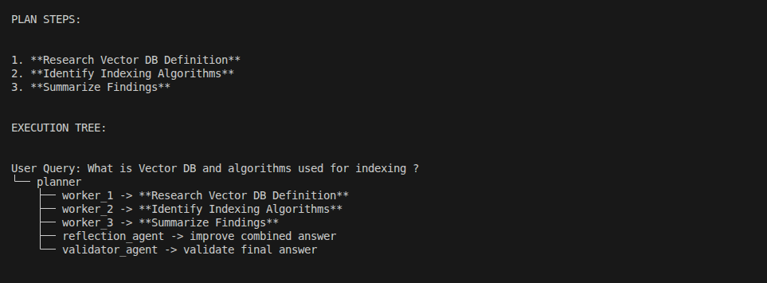

# Flow Diagram

## Orchestration Pattern: Planner → Workers → Validator



## DAG Based Execution

- Directed: Each connection in the graph goes from one point to another, not back and forth.
- Acyclic: can’t loop back to where you started. If you follow the arrows, you’ll never end up at the same node twice.
- Graph: It’s just a collection of “nodes” (which are like individual tasks or steps) and “edges” (which are the arrows connecting them, showing the order they should be done in).

### Key Technical Components
1. **Planner Agent**: Breaks the user request into a serialized list of task steps using DAG logic.
2. **Worker Agents**: Instances of the Worker class that execute tasks in parallel.
3. **Reflection Agent**: Critiques the combined output of all workers to improve clarity and logic.
4. **Validator Agent**: Performs the final check for factual accuracy and logical consistency.
5. **Execution Tree**: A recursive data structure that tracks every agent's thought process.

## Code Snippet
```python
# Sequential/Parallel Agent dispatch logic
for step in plan.steps:
    output = await runtime.send_message(
        WorkerInput(step=step, query=query),
        AgentId(step.owner, "default")
    )
    # Collect outputs for Reflection/Validation stages
```

### Execution Tree

