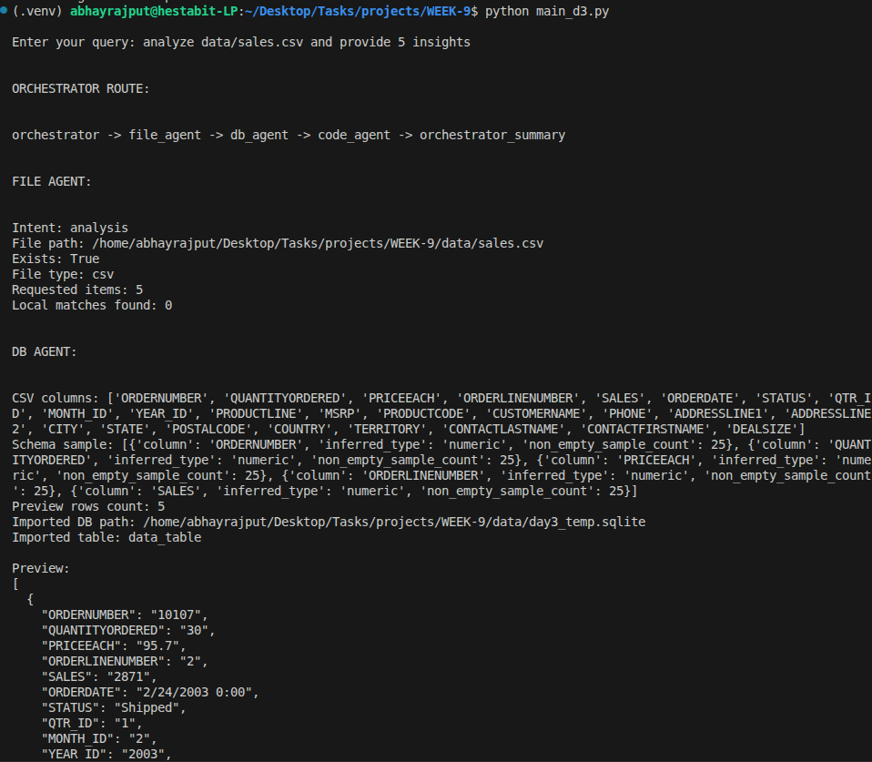
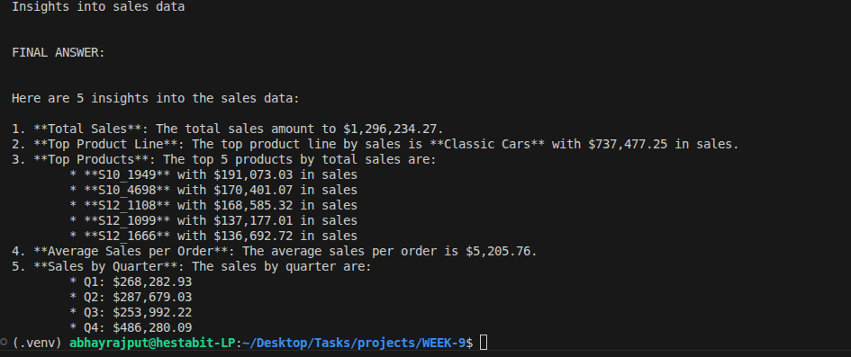

# Day 3: Tool-Calling Agents

## Folder Structure
```text
├── tools/
│   ├── code_executor.py
│   ├── db_agent.py
│   └── file_agent.py
├── main_d3.py
└── TOOL-CHAIN.md
```

## Tasks Completed
- Built agents capable of Python code execution and shell interaction.
- Implemented a DB Agent for SQLite and CSV querying.
- Created a File Agent for reading and writing .txt and .csv files.
- Coordinated File + Code + Analysis agents to analyze data from sales.csv.

## Code Snippet
```python
# Example of a tool agent registration
await FileAgent.register(
    runtime,
    "file_agent",
    lambda: FileAgent("file_agent", debug_mode=True)
)
await DBAgent.register(
    runtime,
    "db_agent",
    lambda: DBAgent("db_agent", debug_mode=True)
)
```

## Command to Run
```bash
python3 main_d3.py
```

## Output


