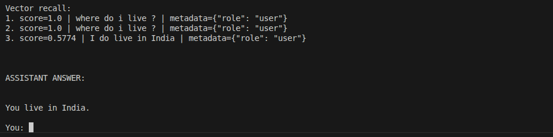

# Day 4: Memory Systems

## Folder Structure
```text
├── memory/
│   ├── session_memory.py
│   ├── vector_store.py
│   └── long_term.db
├── main_d4.py
└── MEMORY-SYSTEM.md
```

## Tasks Completed
- Implemented Short-term session memory for conversation history.
- Built Long-term factual memory using SQLite.
- Integrated Vector memory (FAISS) for similarity-based recall.
- Developed an "Extract & Search" flow to inject relevant history into AI prompts.

## Code Snippet
```python
# Memory recall and injection flow
fact_hits = session_memory.search_facts(user_query, limit=5)
vector_hits = vector_store.search(user_query, k=3)

memory_context = build_memory_context(
    recent_context=session_memory.format_recent_context(),
    fact_context=session_memory.format_fact_results(fact_hits),
    vector_context=vector_store.format_search_results(vector_hits)
)
```

## Command to Run
```bash
python3 main_d4.py
```

## Screenshots

