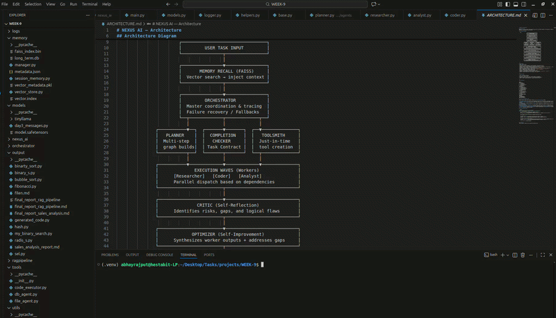

# NEXUS AI

## How Execution is Done

1.  **Memory Recall**: The system searches through **FAISS (Vector)** and **SQLite (Episodic)** stores to inject relevant historical context into the current task.
2.  **Autonomous Planning**: The **Planner** decomposes the user query into a Directed Acyclic Graph (DAG) of actionable steps.
3.  **Fulfillment Contracting**: The **Completion Checker** extracts a "Fulfillment Contract" that defines the required sections, depth, and artifacts.
4.  **Parallel Execution Waves**: The **Orchestrator** dispatches workers (**Researcher**, **Coder**, **Analyst**) in parallel waves based on their dependencies.
5.  **Self-Reflection & Improvement**:
    *   The **Critic** identifies logical gaps or risks in the worker outputs.
    *   The **Optimizer** synthesizes the results into a cohesive final draft while addressing the Critic's feedback.
6.  **Multi-Stage Validation**: The **Validator** audits the draft against the Fulfillment Contract, checking for structural integrity, execution success, and grounding.
7.  **Final Reporting**: The **Reporter** compiles the final answer, an execution tree of the process, and a manifest of all saved artifacts.

---

## Demonstration: AI Startup Planning

**Input Task:**
```text
[NEXUS] > Generate a comprehensive business and technical plan for an AI-based startup in the service-based industry. Save it as output/plan_ai.md.
```

### Execution Walkthrough:
1.  **Orchestration Initialized**: NEXUS initializes the session and recalls background context about service-industry AI trends.
2.  **Graph Construction**: The **Planner** builds a multi-step DAG including market analysis, service design, and technical architecture.
3.  **Contract Extraction**: The **Completion Checker** mandates specific headers for "Revenue Model" and "Tech Stack", and ensures the creation of `output/plan_ai.md`.
4.  **Parallel Waves**: The Researcher gathers data while the Analyst designs the service logic; subsequently, the Coder generates the technical architecture.
5.  **Critique & Optimization**: The **Critic** flags gaps (e.g., scalability), which the **Optimizer** fills during the draft synthesis.
6.  **Final Audit**: The **Validator** confirms that `output/plan_ai.md` was saved and all contract requirements are satisfied.


## Implementation Recording
Below is the recording of the actual implementation:


