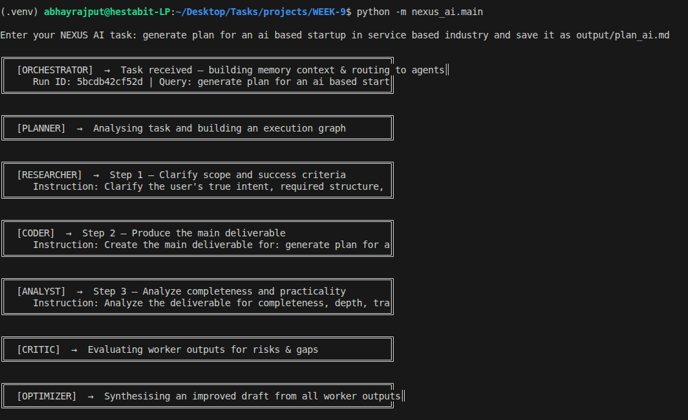
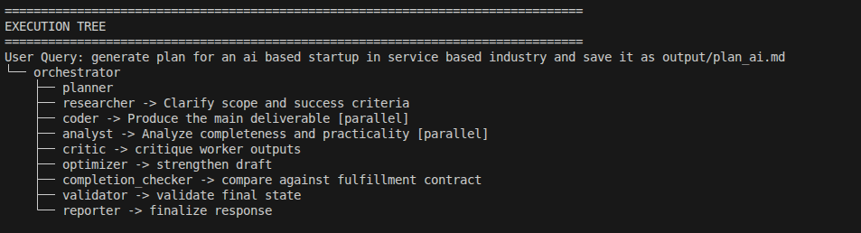

# NEXUS AI — Final Report


## Status
| Capability | Status |
|-----------|--------|
| Multi Agents | Complete |
| Orchestrator | Complete |
| Tool Calling | Complete |
| Memory (FAISS + SQLite) | Complete |
| Self-Reflection (Critic) | Complete |
| Self-Improvement (Optimizer) | Complete |

## Code Snippet
```python
# Validation score and failure recovery logic
if validator.score < 0.8:
    _print_agent_banner("orchestrator", "Triggering failure recovery retry loop")
    worker_outputs = await self._retry_targeted_steps(
        retry_targets=validator.retry_targets,
        issues=validator.issues
    )
```

## Agent Implementations & Roles
| Agent | Implementation Details | Key Responsibilities |
|-------|------------------------|----------------------|
| **Orchestrator** | Dispatches tasks in dependency waves, manages handoffs, and triggers recovery loops. | Master coordination and session tracing. |
| **Planner** | Generates a Directed Acyclic Graph (DAG) plan from complex user queries. | Task decomposition & reasoning. |
| **Completion Checker** | Generates "Fulfillment Contracts" and performs strict semantic audits. | Semantic quality enforcement. |
| **Toolsmith** | Generates JIT Python helper tools for missing or specialized requirements. | On-the-fly tool capability expansion. |
| **Researcher** | Performs multi-source retrieval (Web/File) with context-aware summarization. | Information gathering & context. |
| **Coder** | Implements logic, executes code, repairs errors, and creates documents. | Core technical implementation. |
| **Analyst** | Processes CSV data, executes SQL, and derives business insights. | Data-driven reasoning. |
| **Critic** | Evaluates outputs for logical gaps, contradictions, and security risks. | Self-reflection & quality audit. |
| **Optimizer** | Synthesizes multiple worker outputs into a refined, high-quality final draft. | Draft synthesis & refinement. |
| **Validator** | Executes a score-based audit of artifacts, depth, execution, and grounding. | Final verification & scoring. |
| **Reporter** | Compiles the markdown report, execution tree, and artifact manifest. | Deliverable presentation. |

## System Architecture Details
| Layer | Component | Status |
|-------|-----------|--------|
| **Routing** | Dependency-Wave Parallel Execution | Production |
| **Storage** | Hybrid SQLite (Episodic) + FAISS (Vector Store) | Production |
| **Context** | Injected Session + Recalled Memory | Production |
| **Resilience** | Fallback Owners & Targeted Retry Loop | Production |
| **Safety** | Sanitized Path Management & Code Sandboxing | Production |


## Screenshots


